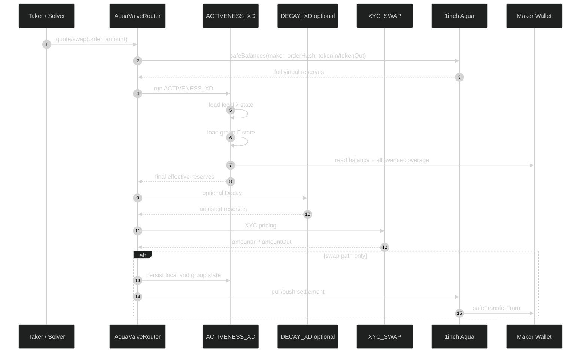

# FULL_EXECUTION.md — AquaValve

## 1. System Overview

AquaValve is a custom 1inch Aqua app and SwapVM extension that makes liquidity liveness programmable. It adds the `ACTIVENESS_XD` instruction to the SwapVM instruction pipeline, sitting before the optional `DECAY_XD` and the terminal `XYC_SWAP`.

```
ACTIVENESS_XD → optional DECAY_XD → XYC_SWAP → Aqua settlement
```

AMMs made price programmable. AquaValve makes liveness programmable.

## 2. Actors

| Actor | Role |
|---|---|
| **Maker** | Owns inventory, sets λ and Γ parameters, ships Aqua strategies. |
| **Taker / Solver** | Quotes and fills positions via the router. |
| **Aqua** | Stores virtual balances per position and settles real token transfers. |
| **AquaValveRouter** | Modified Aqua SwapVM router with appended `ACTIVENESS_XD`. |
| **ACTIVENESS_XD** | Stateful SwapVM instruction controlling local λ and shared Γ. |
| **DemoTaker** | Test helper contract for same-transaction multi-order execution. |
| **The Graph Subgraph** | Indexes `ActivenessApplied` events for live capacity discovery (planned). |

## 3. Contract Responsibilities

| Contract | Responsibility | Status |
|---|---|---|
| `Activeness.sol` | `ACTIVENESS_XD` instruction: local λ scaling, shared Γ envelope, coverage checks, state persistence. | Planned |
| `AquaValveRouter.sol` | SwapVM router with `ACTIVENESS_XD` appended to `_instructions()`. Exposes `activenessOpcode()` helper. | Planned |
| `AquaValveOrderBuilder.sol` | Builds strategy bytes with activeness parameters. Uses `router.hash(order)` for order-hash source of truth. | Planned |
| `DemoTaker.sol` | Calls multiple orders in a single transaction to demonstrate shared Γ behavior. | Planned |

## 4. State

### 4.1 Local Position State

```solidity
// localState[orderHash][token]
struct LocalState {
    uint256 blockNumber;    // last interaction block
    uint256 activeReserveIn;
    uint256 activeReserveOut;
}
```

Purpose: prevent same-block reactivation of local λ. When `block.number == localState.blockNumber`, the active curve continues from the consumed state. When `block.number > localState.blockNumber`, the position repartitions from the current total reserves.

### 4.2 Shared Group State

```solidity
// groupState[maker][groupId][token]
struct GroupState {
    uint256 blockNumber;      // block when envelope opened
    uint256 openingCoverage;  // min(balance, allowance) at envelope open
    uint256 remaining;        // remaining envelope capacity
}
```

Purpose: make sibling Aqua positions share a wallet-level execution envelope within a block. Group state uses ordinary storage (not transient storage) so it persists across calls within the same outer transaction.

### 4.3 Coverage

Executable coverage is at most:

```
min(ERC20(token).balanceOf(maker), ERC20(token).allowance(maker, Aqua))
```

- Coverage drops shrink the quote proportionally. They must not permanently brick `quote()`.
- Same-block inflows do not reopen group capacity. Next block refreshes from new coverage.

## 5. State Machine

### Local λ

```
Fresh → ActiveBlock (new block, apply λ)
ActiveBlock → ConsumedCurve (trade executes, curve moves)
ConsumedCurve → ConsumedCurve (same block, another trade)
ConsumedCurve → ActiveBlock (next block, repartition)
ActiveBlock → Reverted (exactOut >= effective active)
Reverted → ActiveBlock (next block)
```

### Shared Γ

```
Idle → Open (first sibling interaction, snapshot coverage)
Open → Consuming (fill reduces remaining)
Consuming → Consuming (another sibling, same block)
Consuming → GroupExceeded (remaining < requested)
Open/Consuming/GroupExceeded → Open (next block, refresh)
Open → ShrunkQuote (coverage dropped, scale down)
ShrunkQuote → Consuming (fill within shrunk capacity)
```

> Full state machine diagram: [docs/diagrams/03_state_machine.mmd](docs/diagrams/03_state_machine.mmd)

## 6. Exact Transaction Flow



## 7. Quote vs Swap Behavior

| Aspect | Quote | Swap |
|---|---|---|
| State reads | local λ + group Γ + coverage | Same |
| State writes | **None** | Persist local + group changes |
| ERC-20 transfers | None | Aqua executes safeTransferFrom |
| Revert on exceeded | Returns 0 or reverts with named error | Reverts with named error |

Key invariant: `quote()` must never mutate state. The test `quote_does_not_mutate_state` verifies this.

## 8. Failure Paths

| Failure Condition | Error | Recovery |
|---|---|---|
| `amountOut >= finalEffectiveActiveOut` | `ActiveLiquidityExceeded` | Reduce amount or wait for next block |
| Sibling order exceeds remaining Γ | `GroupActiveLiquidityExceeded` | Reduce amount or wait for next block |
| Maker balance drops mid-block | Quote shrinks proportionally | No brick — returns smaller quote |
| Maker allowance drops mid-block | Quote shrinks proportionally | No brick — returns smaller quote |
| Same-block inflow after consumption | Envelope does not reopen | Wait for next block |
| Wrong opcode index | Test gate catches before demo | Use `activenessOpcode()` helper |
| Hash mismatch (off-chain vs on-chain) | `aqua_strategy_hash_matches_router_order_hash` test fails | Use `router.hash(order)` as source of truth |
| Underfunded wallet at settlement | ERC-20 safeTransferFrom reverts (Aqua-level) | AquaValve does not guarantee solvency |

> Full failure flowchart: [docs/diagrams/04_failure_paths.mmd](docs/diagrams/04_failure_paths.mmd)

## 9. Test Gates

### Gate 0 — Compile

```bash
forge build
```

**Status:** Planned — no contracts implemented yet.

### Gate 1 — Local λ

| Test | What it proves |
|---|---|
| `lambda_100_equals_XYC` | λ = 100% produces identical output to vanilla XYC |
| `same_block_does_not_refresh_lambda` | Second trade in same block continues on consumed curve |
| `split_trade_does_not_reactivate_liquidity` | Split exact-in does not get fresh active slice |
| `next_block_repartitions` | New block computes fresh active reserves from total state |
| `exact_in_continues_on_consumed_curve` | Sequential exact-in trades face the moved curve |
| `exact_out_above_effective_active_reverts` | exactOut >= effective active → `ActiveLiquidityExceeded` |
| `quote_does_not_mutate_state` | quote path has zero state side effects |

**Status:** Planned.

### Gate 2 — Shared Γ

| Test | What it proves |
|---|---|
| `two_orders_same_tx_share_group_budget` | DemoTaker fills A then B; B sees consumed group state |
| `coverage_drop_shrinks_quote_not_reverts` | Reduced balance → smaller quote, not a brick |
| `allowance_drop_shrinks_quote_not_reverts` | Reduced allowance → smaller quote, not a brick |
| `same_block_inflow_does_not_reopen_envelope` | Deposit in same block does not refresh group capacity |

**Status:** Planned.

### Gate 3 — Decay Composition

Run the same swap sequence through four pipeline configurations:

1. XYC only
2. DECAY + XYC
3. ACTIVENESS + XYC
4. ACTIVENESS + DECAY + XYC

Compare executed volume, price, and state changes across configurations.

**Status:** Planned.

### Gate 4 — Demo

- Real Aqua ship with maker position.
- Real token transfer via Aqua settlement.
- Local λ visualization (active vs inactive reserves).
- Shared Γ failure path (`GroupActiveLiquidityExceeded`).
- Quote shrink after coverage drop.

**Status:** Planned.

### Hash Integrity

```
aqua_strategy_hash_matches_router_order_hash
```

Uses `router.hash(order)` as source of truth. No independent off-chain hash reimplementation.

**Status:** Planned.

## 10. Demo Sequence

| Step | Action | Expected Output |
|---|---|---|
| 1 | Open | *"Liquidity doesn't have to be all-in."* |
| 2 | Show maker wallet with two Aqua positions | Both positions show local active reserves |
| 3 | Execute Position A | Group budget partially consumed |
| 4 | Attempt Position B (exact-out > remaining Γ) | `GroupActiveLiquidityExceeded` |
| 5 | **Punchline** | *"This second order looks locally executable, but the shared wallet envelope has already been consumed. AquaValve tells the solver before settlement would revert."* |
| 6 | Retry B smaller | Real ERC-20 transfer succeeds |
| 7 | Drop maker coverage | Quote shrinks proportionally, no brick |
| 8 | Decay composition | Side-by-side comparison of 4 pipelines |

> Full demo flow: [docs/diagrams/06_demo_flow.mmd](docs/diagrams/06_demo_flow.mmd)

## 11. Deployment Steps

1. Deploy mock ERC-20 tokens (or use testnet tokens).
2. Deploy Aqua (or fork existing deployment).
3. Deploy `Activeness.sol`.
4. Deploy `AquaValveRouter.sol` with `ACTIVENESS_XD` appended to `_instructions()`.
5. Deploy `AquaValveOrderBuilder.sol`.
6. Deploy `DemoTaker.sol`.
7. Fund maker wallet with test tokens.
8. Approve Aqua for maker's tokens.
9. Create two Aqua positions with `ACTIVENESS_XD` strategy bytes.
10. Run demo script.

**Status:** Planned — requires contracts first.

## 12. The Graph Integration (Planned)

**Layer:** Live capacity discovery for solvers and frontend.

**Events to index:**

```solidity
event ActivenessApplied(
    bytes32 indexed orderHash,
    address indexed maker,
    bytes32 indexed groupId,
    address token,
    uint256 effectiveActive,
    uint256 totalReserve,
    uint256 groupRemaining,
    uint256 blockNumber
);
```

**Subgraph entities:**

- `ActivePosition` — per-order active reserves per block.
- `GroupEnvelope` — per-maker, per-group remaining capacity.
- `CoverageSnapshot` — balance/allowance readings.

Solvers query the subgraph to discover which positions have available capacity before routing, avoiding wasted gas on positions that will revert.

## 13. Known Limitations

- AquaValve does not make an underfunded wallet solvent.
- Group state uses ordinary storage, so gas cost scales with number of groups.
- Same-block inflow does not reopen the envelope — conservative by design.
- The Graph subgraph has a block-level lag — stale data may cause solver mispricing within a block.
- World ID Selfie Check is a stretch integration and does not secure swaps.

## 14. Cut Lines

If **Gate 2 fails** by the deadline, ship local-λ only:

```
ACTIVENESS_XD + Decay composition + benchmark + UI
```

Do not ship half-working Γ.

If **Decay composition fails**, ship:

```
ACTIVENESS_XD + local λ + shared Γ + failure-path tests
```

Do not add new sponsor tracks until core is green.
