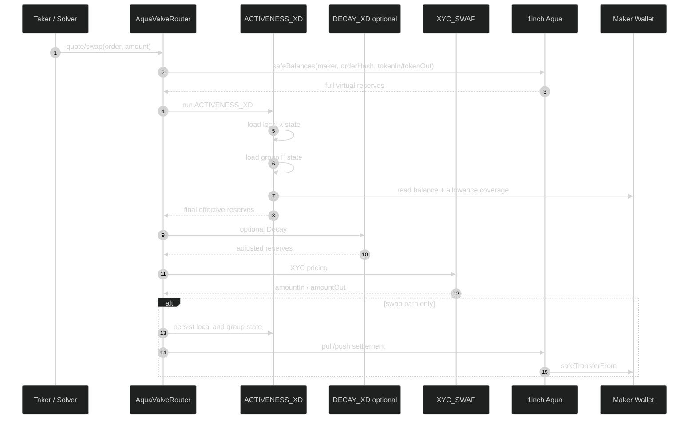

# FULL_EXECUTION.md — AquaValve

## 1. Goal

Build and demonstrate a custom Aqua + SwapVM app where liquidity liveness is programmable.

Core mechanism:

```text
ACTIVENESS_XD → optional DECAY_XD → XYC_SWAP → Aqua settlement
```

## 2. Actors

| Actor | Role |
|---|---|
| Maker | Owns inventory and ships Aqua strategies. |
| Taker / Solver | Quotes and fills positions. |
| Aqua | Stores virtual balances and settles token transfers. |
| AquaValveRouter | Modified Aqua SwapVM router with appended `ACTIVENESS_XD`. |
| ACTIVENESS_XD | Stateful instruction controlling live reserves. |
| DemoTaker | Test helper for same-transaction multi-order execution. |

## 3. State

### Local position state

```text
localState[orderHash][token]
  blockNumber
  activeReserve
```

Purpose: prevent same-block reactivation of local λ.

### Shared group state

```text
groupState[maker][groupId][token]
  blockNumber
  openingCoverage
  remaining
```

Purpose: make sibling Aqua positions share a wallet-level execution envelope.

## 4. Coverage

Current executable coverage:

```text
min(
  ERC20(token).balanceOf(maker),
  ERC20(token).allowance(maker, Aqua)
)
```

Coverage drops shrink quote. They must not permanently brick `quote()`.

Same-block inflows do not reopen group capacity. Next block refreshes from new coverage.

## 5. Execution Flow



## 6. Same-Block Behavior

Same-block exact-in trades can continue, but they face the consumed active curve.

Wrong mental model:

```text
20 ETH quota → once used, stop
```

Correct mental model:

```text
20 ETH / 80k USDC active AMM curve
Trade 1 moves the curve
Trade 2 continues on moved curve
No fresh active slice until next block
```

## 7. Failure Paths

| Failure | Expected behavior |
|---|---|
| exactOut >= final effective output reserve | `ActiveLiquidityExceeded` |
| sibling position exceeds remaining Γ | `GroupActiveLiquidityExceeded` |
| maker balance drops | quote shrinks, no brick |
| allowance drops | quote shrinks, no brick |
| wrong opcode index | tests must fail before demo |
| quote path | no state mutation |

## 8. Test Gates

### Gate 0 — Compile

```bash
forge build
```

### Gate 1 — Local λ

- `lambda_100_equals_XYC`
- `same_block_does_not_refresh_lambda`
- `split_trade_does_not_reactivate_liquidity`
- `next_block_repartitions`
- `exact_in_continues_on_consumed_curve`
- `exact_out_above_effective_active_reverts`
- `quote_does_not_mutate_state`

### Gate 2 — Shared Γ

Use a real helper contract. Do not rely only on a JS model.

- `two_orders_same_tx_share_group_budget`
- `coverage_drop_shrinks_quote_not_reverts`
- `allowance_drop_shrinks_quote_not_reverts`
- `same_block_inflow_does_not_reopen_envelope`

### Gate 3 — Decay Composition

Run the same swap sequence through:

- XYC only
- DECAY + XYC
- ACTIVENESS + XYC
- ACTIVENESS + DECAY + XYC

### Gate 4 — Benchmarks

Compare:

- executed volume,
- LP relative PnL,
- price tracking error,
- inventory moved.

## 9. Demo Script

1. Open with: “Liquidity doesn't have to be all-in.”
2. Show a maker wallet with two Aqua positions.
3. Show both positions locally active.
4. Execute A and consume group capacity.
5. Attempt B above remaining Γ; show named revert.
6. Retry B smaller; show real transfer.
7. Show coverage drop shrinks quote.
8. Show Decay composition.

## 10. Cut Lines

If Gate 2 fails by the deadline, ship a local-λ only version:

```text
ACTIVENESS_XD + Decay composition + benchmark + UI
```

Do not ship half-working Γ.

If Decay composition fails, ship:

```text
ACTIVENESS_XD + local λ + shared Γ + failure-path tests
```

Do not add new sponsor tracks until core is green.
