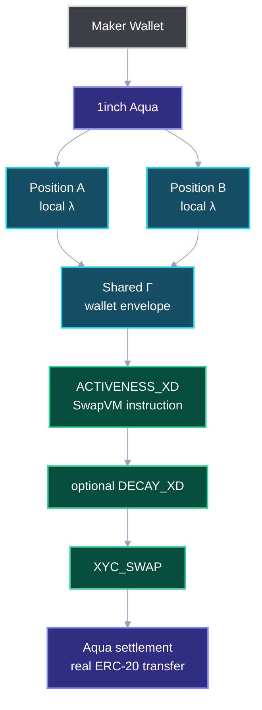

# AquaValve

> **Liquidity doesn't have to be all-in. AquaValve lets a maker decide how much goes live each block.**

AquaValve turns Aqua shared liquidity from soft virtual promises into programmable live capacity.

## The Problem

AMM liquidity is usually all-in: if an LP provides inventory, the market can reprice the full amount immediately. In 1inch Aqua, the situation is more subtle — one maker wallet can back many positions, and each strategy tracks virtual balances independently. A sibling position can look executable even after another sibling consumed the real wallet capacity, causing **route-first, revert-later** behavior.

AquaValve does not make an underfunded wallet solvent. Aqua's ERC-20 transfer remains the final hard constraint. AquaValve moves the failure earlier: from settlement-time revert to **quote-time deterministic capacity**.

## What AquaValve Does

AquaValve adds a SwapVM instruction called `ACTIVENESS_XD` with two layers:

### Local λ — per-position live liquidity

A maker sets a local activeness fraction. If the full virtual reserve is 100 ETH / 400,000 USDC and `λ = 20%`, this block's active curve starts as 20 ETH / 80,000 USDC.

- `λ = 100%` behaves like normal XYC (no restriction).
- Same-block trades continue on the consumed active curve — no fresh slice.
- Exact-out reverts only when `amountOut >= finalEffectiveActiveOut`.
- Next block repartitions from the current total state.

### Shared Γ — wallet-level execution envelope

Sibling Aqua positions sharing the same maker wallet get a per-maker, per-group, per-token envelope. Executable coverage is clamped to:

```
min(maker token balance, maker allowance to Aqua)
```

- Coverage drops **shrink** quotes instead of bricking `quote()` calls.
- Same-block inflows do not reopen the envelope until the next block.
- Group state is keyed by `maker + groupId + token` in ordinary storage (not transient).

## Architecture



> Full diagram source: [docs/diagrams/01_architecture.mmd](docs/diagrams/01_architecture.mmd)

## Execution Flow

```
ACTIVENESS_XD → optional DECAY_XD → XYC_SWAP → Aqua settlement
```

1. Router receives `quote` or `swap` call.
2. Aqua returns full virtual reserves for the position.
3. `ACTIVENESS_XD` applies local λ (scales reserves) and shared Γ (clamps to wallet envelope).
4. Optional `DECAY_XD` adjusts for time-based price impact recovery.
5. `XYC_SWAP` computes final pricing.
6. On swap path only: persist state changes and execute Aqua settlement.

> Full sequence diagram: [docs/diagrams/02_execution_sequence.mmd](docs/diagrams/02_execution_sequence.mmd)

## Decay vs AquaValve

Decay controls **how quickly** price impact recovers. AquaValve controls **how much inventory** participates in that repricing. They are orthogonal and composable:

| Pipeline | What it tests |
|---|---|
| XYC only | Baseline |
| DECAY + XYC | Time recovery without liveness control |
| ACTIVENESS + XYC | Liveness control without time recovery |
| ACTIVENESS + DECAY + XYC | Full composition |

## Failure Paths

| Failure | Expected Behavior |
|---|---|
| `exactOut >= finalEffectiveActiveOut` | `ActiveLiquidityExceeded` revert |
| Sibling exceeds remaining Γ | `GroupActiveLiquidityExceeded` revert |
| Maker balance drops | Quote shrinks proportionally, no brick |
| Maker allowance drops | Quote shrinks proportionally, no brick |
| Quote path | No state mutation |
| Same-block inflow | Envelope does not reopen until next block |

> Full failure flowchart: [docs/diagrams/04_failure_paths.mmd](docs/diagrams/04_failure_paths.mmd)

## Key Files

### Contracts (planned)

```
contracts/Activeness.sol           — ACTIVENESS_XD instruction
contracts/AquaValveRouter.sol      — modified SwapVM router
contracts/AquaValveOrderBuilder.sol — strategy builder
contracts/DemoTaker.sol            — multi-order test helper
test/ActivenessSinglePosition.t.sol — Gate 1: local λ tests
test/ActivenessGroupEnvelope.t.sol  — Gate 2: shared Γ tests
test/ActivenessDecayComposition.t.sol — Gate 3: decay tests
```

### Frontend (implemented)

```
component/connectWallet/           — MetaMask wallet connection
component/world_verif_button/      — World ID Selfie Check (stretch)
lib/world_verif_button/            — server-side verification handlers
app/                               — Next.js pages and API routes
```

### Diagrams

```
docs/diagrams/01_architecture.mmd
docs/diagrams/02_execution_sequence.mmd
docs/diagrams/03_state_machine.mmd
docs/diagrams/04_failure_paths.mmd
docs/diagrams/05_sponsor_layers.mmd
docs/diagrams/06_demo_flow.mmd
```

## Running

### Frontend

```bash
npm install
npm run dev
```

### Contracts (once implemented)

```bash
forge build
forge test
```

## Test Gates

| Gate | Scope | Status |
|---|---|---|
| Gate 0 | `forge build` compiles | Planned |
| Gate 1 | Local λ (7 tests) | Planned |
| Gate 2 | Shared Γ (4 tests) | Planned |
| Gate 3 | Decay composition (4 pipelines) | Planned |
| Gate 4 | Demo (live transfers + visualization) | Planned |

> Full test plan: [TEST_PLAN.md](TEST_PLAN.md)

## Demo Path

1. Open with: *"Liquidity doesn't have to be all-in."*
2. Create two Aqua positions backed by one maker wallet, `λ = 20%`.
3. Show both positions have local active reserves.
4. Execute Position A — consumes group budget.
5. Attempt Position B above remaining Γ → `GroupActiveLiquidityExceeded`.
6. **"This second order looks locally executable, but the shared wallet envelope has already been consumed. AquaValve tells the solver before settlement would revert."**
7. Retry B smaller → real ERC-20 transfer.
8. Show coverage drop shrinks quote instead of bricking.
9. Show `ACTIVENESS_XD + DECAY_XD + XYC_SWAP` composition.

> Full demo flow: [docs/diagrams/06_demo_flow.mmd](docs/diagrams/06_demo_flow.mmd)

## Sponsor Fit

| Sponsor | Layer | Removal Test |
|---|---|---|
| **1inch Aqua** | Shared wallet + settlement | Core — cannot remove |
| **SwapVM** | `ACTIVENESS_XD` instruction | Core — cannot remove |
| **The Graph** | Live capacity subgraph | Remove → core works, discovery is manual |
| World ID | Human step-up gate (stretch) | Remove → core works, no human gate |
| Ledger | Hardware approval (stretch) | Remove → core works, no hw approval |
| Chainlink CRE | Private headroom policy (stretch) | Remove → core works, no private headroom |
| Uniswap v4 | Local λ portability proof (stretch) | Remove → core works, no portability proof |

> Full sponsor diagram: [docs/diagrams/05_sponsor_layers.mmd](docs/diagrams/05_sponsor_layers.mmd)

## Non-Claims

- AquaValve does **not** guarantee solvency.
- World ID Selfie Check does not secure swaps or prove wallet ownership.
- Uniswap is not required for the Aqua project to be complete.
- Opcode index is not hard-coded; it appends to the `_instructions()` table.
- Model tests are not Solidity integration tests.
- No compile, test, or deployment success is claimed unless command output proves it.

## Current Status

| Layer | Status |
|---|---|
| Frontend (wallet connect, World ID) | Implemented |
| Solidity contracts | Planned |
| Test suite (Foundry) | Planned |
| The Graph subgraph | Planned |
| Demo script | Planned |

## Roadmap

1. Implement `Activeness.sol` and `AquaValveRouter.sol`.
2. Pass Gate 0 (compile) and Gate 1 (local λ).
3. Implement shared Γ and pass Gate 2.
4. Decay composition — Gate 3.
5. The Graph live capacity subgraph.
6. Demo with real Aqua ship — Gate 4.
7. Stretch sponsor integrations only after core is green.
