# RESHUFFLE

**A market for outcomes, not listings.**

You never give up your tickets unless the whole replacement arrives.


---

## The problem

### The user's version

> I bought Sunday tickets as a backup because I didn't know if I'd get the date I wanted. Then I got Tuesday. Now I'm stuck with three Sunday tickets, resale isn't open, and social media is full of scammers.

That is a real 2026 post, and it is not rare. People buy backup tickets, get better ones, and are left holding the first set. Others need four seats together and end up buying extra tickets and reselling them just so a family can sit in one row.

The intent already exists — it is written in forum comments:

> *"HAVE: 4 Toronto, Sec 105. WANT: 4 Vancouver, together. Will pay difference."*

Users are already expressing conditional replacement in natural language. There is just no system that executes it.

### Why current systems can't help

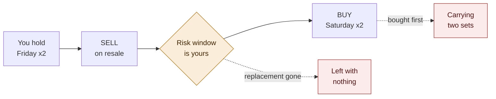

Official exchange usually requires the same event, venue and date, so changing dates is not an exchange at all — it is a sale followed by a purchase.

### And sometimes no bilateral trade exists

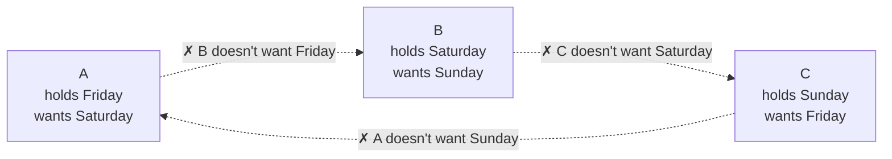

No two people can trade. All three together can. Every pairwise negotiation fails, and the trade that works involves everyone at once.

### The four pains, separated

| # | Pain | Type |
|---|---|---|
| 1 | Replacement exposure — I want to *change*, not to speculate | user pain |
| 2 | No direct counterparty — nobody wants exactly what I hold | matching problem |
| 3 | Bundle constraints — not any two tickets, but a complete outcome | user pain |
| 4 | Coordination — four people cannot all be online at the same second | coordination problem |

Most systems address some of 1–3. Number 4 is what makes the others usable in reality.

---

## The solution

Users sign the **outcome** they will accept, not an order.

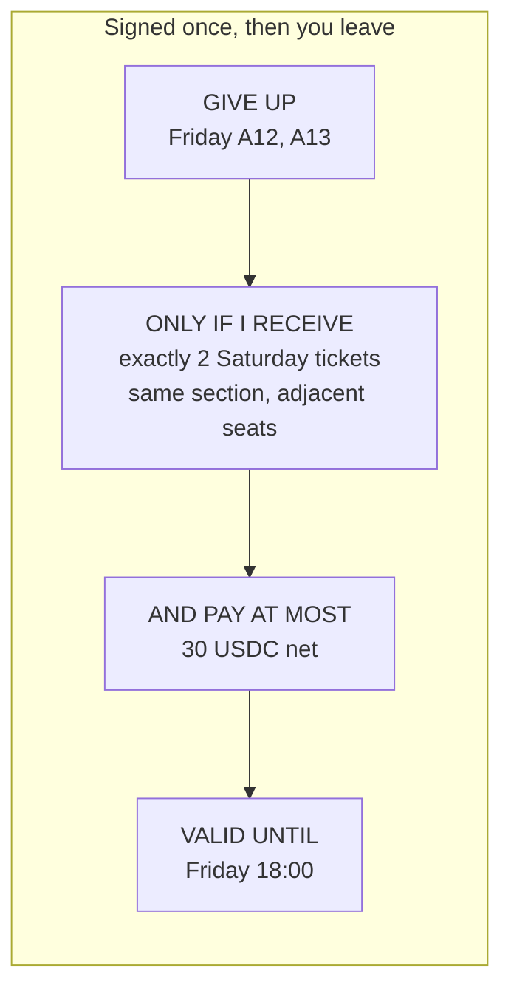

A solver later composes many such intents — including buyers, sellers and unsold issuer inventory — into a reallocation where everyone's signed conditions hold at once. The contract verifies each condition independently and settles atomically.

**Ordinary marketplace:** *How much do you want for your ticket?*
**RESHUFFLE:** *What would have to be true for you to give it up?*

### The property that drives the architecture

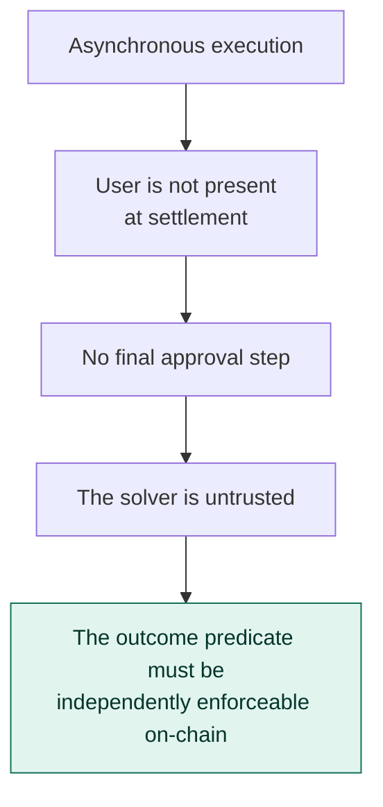

This is why the contract checks session, section, count, cohesion, adjacency, budget, expiry and redemption status. Not to be thorough — because nobody is there to click *confirm*.

---

## High-level architecture

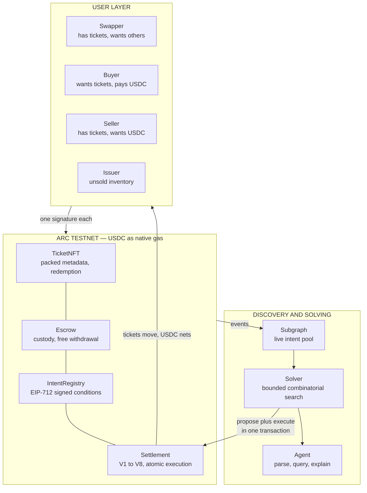

### Trust model

| Layer | Responsibility | Trusted? |
|---|---|---|
| Frontend | Collect conditions, obtain one signature | No |
| Solver | Find a satisfying combination | **No** — the contract re-checks everything |
| Subgraph | Discovery and prefiltering | **No** — chain state at execution is authoritative |
| Settlement | Verify every signed condition | Yes — this is the trust anchor |

### The issuer is a participant, not an operator

Unsold inventory joins the same graph. This is what stops a reshuffle from requiring a closed cycle.

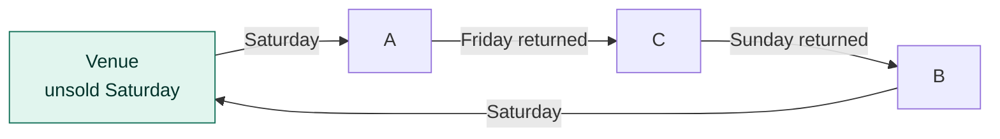

One issuer ticket does not complete a single upgrade — it starts a chain. The returned Friday immediately satisfies the next person's predicate, in the same transaction.

---

## Sponsor technology map

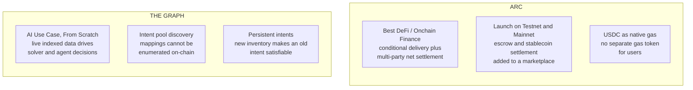

---

## Component flows

### 1. Intent creation

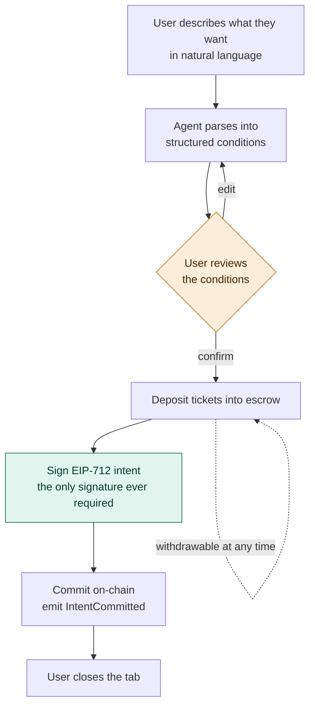

### 2. Discovery and solving

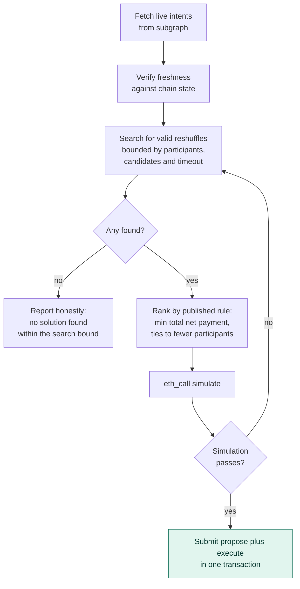

Simulation and submission are one transaction with no window between them. A participant withdrawing in the meantime causes a revert — the proposer loses gas, which is why simulation comes first.

### 3. Settlement validation

The core of the project. Every guarantee is enforced here or not at all.

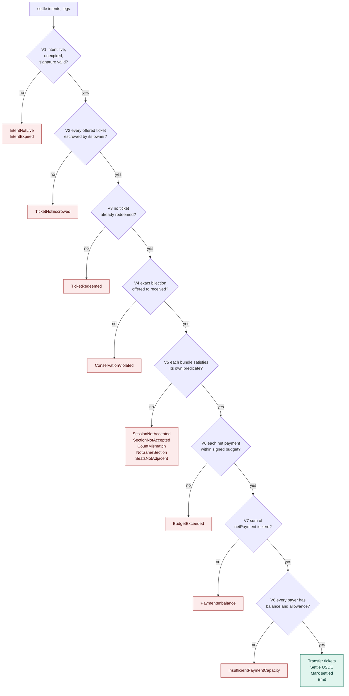

Checks first, effects second, interactions last. Nothing transfers until all eight pass.

### 4. Redemption

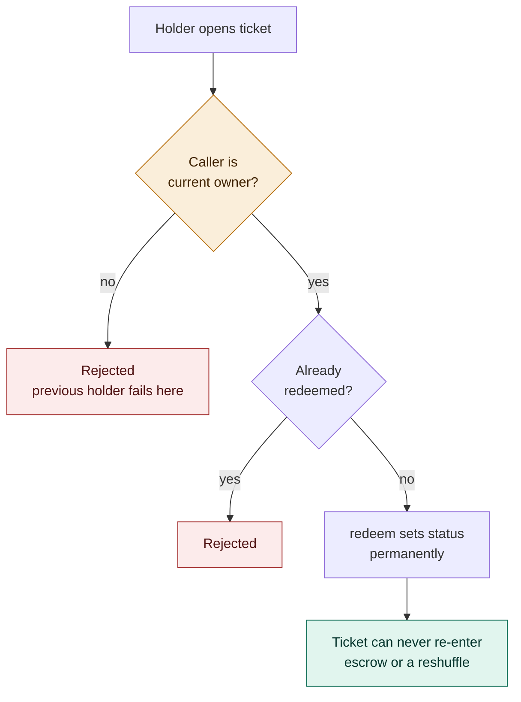

A ticket sitting in escrow must be withdrawn first — revoke the intent, withdraw, then redeem.

---

## Technical reference

### Data model

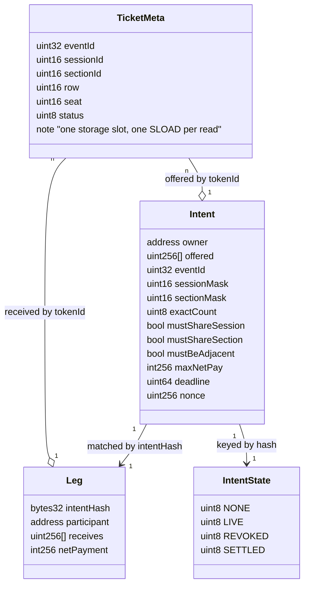

`exactCount` is exact, never a minimum — a user asking for two seats must not receive three.

`mustShareSection` is not implied by `sectionMask`. *Floor or Tier 1 are both acceptable* and *both my tickets must be in the same one* are different statements; two mask bits set does not imply cohesion.

`maxNetPay` is signed: positive is a debit ceiling, negative is a credit floor. One field covers both payers and receivers.

### Contract call graph

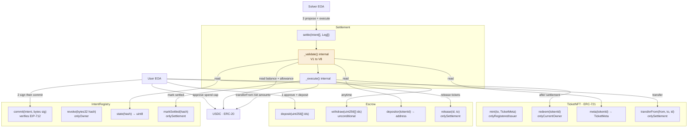

`Settlement` is the only contract permitted to move a ticket out of escrow. Users can always withdraw, but they cannot transfer directly to each other — every reallocation goes through validation.

### Ticket lifecycle

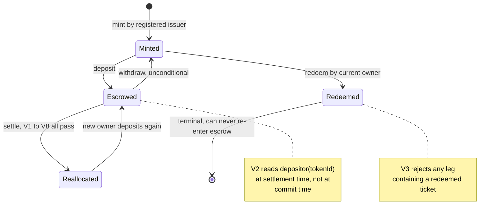

A ticket in escrow cannot be redeemed. Revoke the intent, withdraw, then redeem.

### Intent lifecycle

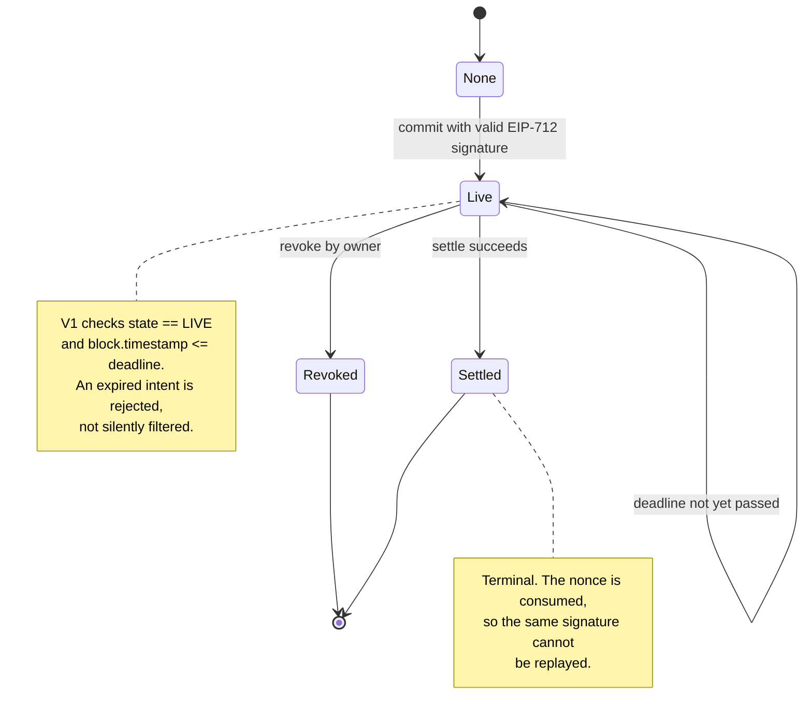

### EIP-712 commitment

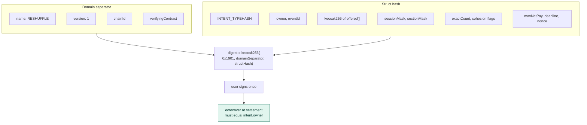

`chainId` and `verifyingContract` are inside the domain. **Redeploying the contracts or moving to another network invalidates every committed intent** and requires reconfiguring the frontend domain. This is a correctness requirement, not a configuration detail — a chain migration is not a matter of changing an RPC URL.

### V4 — conservation, in detail

The check that stops entitlement being created or destroyed.

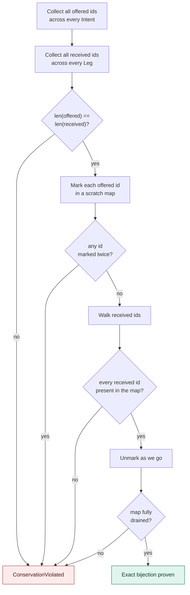

Length equality alone is insufficient — it would admit a proposal that duplicates one ticket and drops another. The scratch map must be fully drained.

### V5 — per-participant predicate, in detail

Runs once per leg. Bitmask operations rather than array scans.

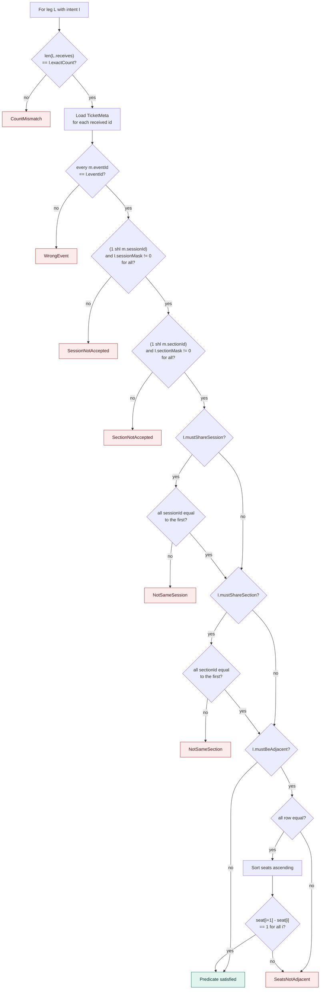

Adjacency is checkable only because we issue the tickets and guarantee seat numbers are consecutive integers within a row. It does not generalise to arbitrary venues.

### V6 to V8 — money

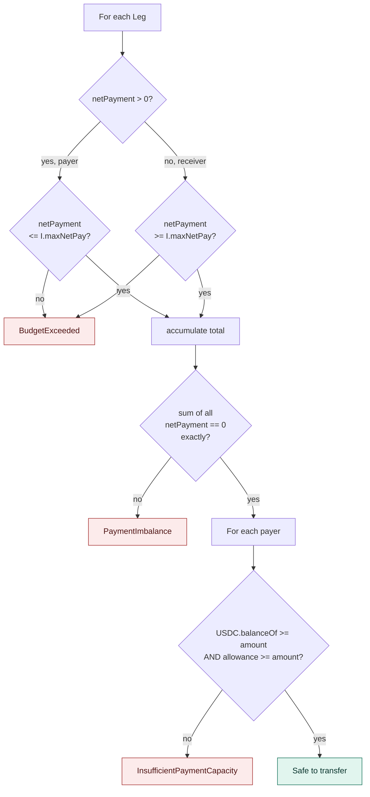

Integer USDC, no rounding tolerance — the sum is exactly zero or the proposal is rejected. Capacity is checked for every payer **before any transfer**, because failing partway through a batch wastes gas and produces a confusing revert.

Approval is a spending allowance, not a reservation. A user can spend their balance elsewhere after signing, which is why V8 reads live state rather than trusting a commitment.

### Solver internals

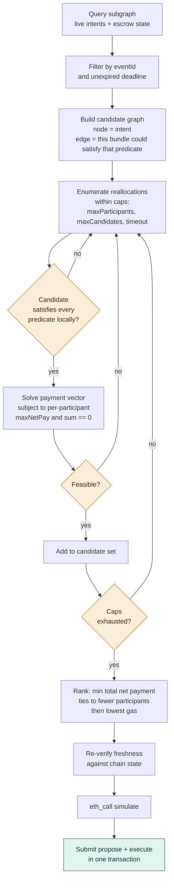

This is a combinatorial exchange and clearing it is NP-hard. The search is bounded and the caps are published. *No solution found* means *none found within the search bound*, not *none exists*.

The solver duplicates the contract's constraint logic so proposals do not fail on-chain, but that duplication is an optimisation, not a guarantee — a different solver could submit anything, and V1–V8 still refuse it.

### Subgraph schema

```mermaid
erDiagram
    TICKET ||--o{ ESCROW_POSITION : "has"
    TICKET }o--o{ INTENT : "offered in"
    TICKET }o--o{ SETTLEMENT_LEG : "received in"
    INTENT ||--o| SETTLEMENT_LEG : "matched by"
    SETTLEMENT ||--|{ SETTLEMENT_LEG : "contains"

    TICKET {
        id String PK
        eventId Int
        sessionId Int
        sectionId Int
        row Int
        seat Int
        owner Bytes
        redeemed Boolean
    }
    ESCROW_POSITION {
        id String PK
        depositor Bytes
        depositedAt BigInt
        active Boolean
    }
    INTENT {
        hash Bytes PK
        owner Bytes
        state String
        sessionMask Int
        sectionMask Int
        exactCount Int
        mustShareSession Boolean
        mustShareSection Boolean
        mustBeAdjacent Boolean
        maxNetPay BigInt
        deadline BigInt
        committedAt BigInt
    }
    SETTLEMENT {
        id String PK
        proposer Bytes
        blockNumber BigInt
        participantCount Int
    }
    SETTLEMENT_LEG {
        id String PK
        netPayment BigInt
    }
```

Indexed events: `TicketMinted`, `TicketEscrowed`, `TicketWithdrawn`, `TicketRedeemed`, `IntentCommitted`, `IntentRevoked`, `Settled`.

The subgraph is discovery and prefiltering. Chain state at execution is authoritative — balances and allowances move, an indexer lags, and the contract re-validates everything regardless.

---

## Sequence diagrams

### Happy path — a three-way reshuffle with nobody online

```mermaid
sequenceDiagram
    autonumber
    participant A as Family A
    participant B as Family B
    participant C as Family C
    participant ESC as Escrow
    participant REG as IntentRegistry
    participant SUB as Subgraph
    participant SOL as Solver
    participant SET as Settlement
    participant USDC as USDC

    A->>ESC: deposit Friday A12, A13
    A->>REG: commit signed intent
    B->>ESC: deposit Saturday
    B->>REG: commit signed intent
    C->>ESC: deposit Sunday
    C->>REG: commit signed intent
    REG-->>SUB: IntentCommitted events

    Note over A,C: All three go offline. No further signatures.

    SOL->>SUB: query live intent pool
    SUB-->>SOL: three standing intents
    SOL->>SOL: bounded search, rank candidates
    SOL->>SET: eth_call simulate
    SET-->>SOL: would succeed
    SOL->>SET: settle in one transaction

    SET->>REG: read committed predicates
    SET->>SET: V1 V2 V3 V4 V5 V6 V7 V8
    SET->>ESC: transfer tickets between owners
    SET->>USDC: net payments, sum equals zero

    SET-->>A: Settled, Saturday B14 and B15, paid 18 USDC
    SET-->>B: Settled
    SET-->>C: Settled
```

### Rejection path — the contract refuses a malicious proposal

```mermaid
sequenceDiagram
    autonumber
    participant SOL as Malicious solver
    participant SET as Settlement
    participant ESC as Escrow

    SOL->>SET: settle with non-adjacent seats
    SET->>SET: V1 intents live ✓
    SET->>SET: V2 tickets escrowed ✓
    SET->>SET: V3 none redeemed ✓
    SET->>SET: V4 conservation holds ✓
    SET->>SET: V5 A required adjacent, got B14 and B27 ✗
    SET--xSOL: revert SeatsNotAdjacent
    Note over SET,ESC: Nothing moved. Everyone keeps their tickets.
```

The guarantee does not rest on trusting our solver. A different solver could submit anything; the contract still refuses.

### Issuer inventory unlocking a broken chain

```mermaid
sequenceDiagram
    autonumber
    participant A as Family A
    participant V as Venue
    participant SOL as Solver
    participant SET as Settlement

    A->>SOL: wants Saturday, no user holds one
    Note over SOL: No closed cycle exists among users
    V->>SET: unsold Saturday sits in escrow
    SOL->>SET: settle including venue as a participant
    SET->>A: A receives Saturday from venue
    SET->>V: venue receives A's Friday
    SET->>SET: that Friday satisfies C in the same transaction
    SET->>SET: C's Sunday satisfies B
    Note over A,SET: One issuer ticket started a four-party chain
```

---

## Sponsor tracks

| Sponsor | Track | Why |
|---|---|---|
| **Arc** | Best DeFi / Onchain Finance | Conditional delivery and multi-party net settlement for non-fungible entitlements. Ticket delivery determines whether payment is permitted; every participant's debits and credits correspond within one settlement |
| **The Graph** | AI Use Case — From Scratch | Live indexed data drives the solver and the agent. Change a budget and the answer changes, because the pool is re-queried |
| **Arc** | Launch on Testnet & Push to Mainnet | *Conditional.* Its examples include stablecoin settlement and escrow logic added to a marketplace. Mainnet readiness is a separate bar — confirming what qualifies before committing |

### How Arc is load-bearing

```mermaid
flowchart TD
    A{"Every ticket condition<br/>satisfied?"} -->|"no"| B["No payment occurs at all"]
    A -->|"yes"| C["USDC nets across all participants"]
    C --> D["A −50 · D −100<br/>B +120 · C +30<br/>sum equals zero"]

    classDef bad fill:#FCEBEB,stroke:#A32D2D,stroke-width:1px,color:#501313
    classDef decide fill:#FAEEDA,stroke:#BA7517,stroke-width:1px,color:#412402
    class B bad
    class A decide
```

Money is not appended at the end. Delivery gates payment, and every participant's cash position resolves in the same settlement.

### How The Graph is load-bearing

Intents live in a Solidity mapping, and mappings cannot be enumerated on-chain. A contract cannot see the pool. Events are what make discovery possible.

More importantly, intents are **persistent**:

```mermaid
flowchart LR
    M["Monday<br/>intent signed"] --> N["No solution<br/>found"]
    N --> T["Tuesday<br/>venue releases<br/>20 tickets"]
    T --> S["Subgraph indexes<br/>new inventory"]
    S --> R["The same intent<br/>becomes satisfiable"]
    R --> X["Settles, with the user<br/>doing nothing"]

    classDef ok fill:#E1F5EE,stroke:#0F6E56,stroke-width:1px,color:#04342C
    class X ok
```

The market changes around a standing intent. That is what live indexed data is for.

*The subgraph is discovery and prefiltering. Chain state at execution is the source of truth — balances and allowances move, and an indexer lags.*

---

## Questions we expect

**Isn't this just a multi-party NFT swap?**
Multi-party barter exists — NeoSwap did it in 2022 with budgets, reserve prices and combinatorial optimisation. Their flow is: bid on specific known items, receive a proposed trade, then everyone signs it. Ours is: sign an outcome predicate once, and any future combination inside those bounds is already approved. Proposal authorisation versus outcome authorisation.

**Isn't this CoW Protocol?**
CoW clears fungible tokens at a uniform price. Tickets are non-fungible and carry per-person bundle constraints — four seats must share a session and a section. No uniform clearing price exists, so what gets verified is not a price but each participant's declared conditions.

**Isn't this Seaport criteria orders?**
Seaport can express "any NFT matching this criterion", and that part is not new. Seaport matches bilaterally. Ours composes many asynchronous predicates into a multi-party reallocation with net cash settlement, without asking anyone to approve a concrete trade.

**Hasn't the theory been done?**
Yes, and we cite it. Top Trading Cycles dates to 1974; kidney exchange is its best-known application; a 2026 Imperial paper studies exactly this for Wimbledon ballot winners, including price differences between courts and dates. Matching-market research shows the reallocation can be improved. We made the conditional replacement executable — signed predicates, on-chain enforcement, asynchronous settlement, issuer inventory as a standing participant.

**What if there's no cycle?**
Buyers and sellers participate in the same pool, so a chain can terminate in cash at either end. Issuer inventory can start one. A closed cycle is one solution shape, not a requirement.

**Two solutions are both valid — who picks?**
The contract checks conditions; it does not rank. Selection is the solver's, and the rule is published: minimise total net payment, ties break toward fewer participants, then lowest gas. The interface separates *your limit*, *what you actually paid*, and *why this candidate*. We never call a result optimal — the search is bounded.

**How do I know the solver isn't cheating me?**
You don't have to. The contract validates the final state against the predicate you signed. A malicious solver can propose anything; V1–V8 refuse it. Try it in the demo.

**What if someone withdraws before settlement?**
The transaction reverts. Nobody is half-traded — that is EVM default behaviour, not our contribution. The proposer loses gas, which is why simulation runs first. Withdrawal is unconditional and immediate, by design.

**Doesn't signing in advance lock my funds?**
No. ERC-20 approval is a spending allowance, not a reservation, and escrowed tickets can be withdrawn at any time. You need not be online at settlement, but settlement still requires your intent, tickets and payment capacity to remain valid.

**Does this work with my Ticketmaster tickets?**
No. Only tickets issued by contracts in our registry. Minting an NFT from a PDF transfers nothing. This is a post-allocation reshuffling layer for issuer-native tickets, not a replacement for existing platforms.

**Why do tickets have to be NFTs?**
Because the contract has to be able to refuse. Adjacency, cohesion and conservation are checked against on-chain ticket data; escrow ownership and redemption status are read at settlement; the transfer itself is what makes the reshuffle atomic. If a ticket were a database row, none of that could happen and users would be back to trusting our server.

**What stops scalpers?**
Nothing here. This reallocates tickets that have already been sold; it creates no seats and prevents no bot from buying them in the first place.

**What about the atomicity guarantee?**
A single transaction reverting wholesale is EVM default behaviour, so we don't claim it as an innovation. The contribution is verifying that a reshuffle satisfies every participant's own signed conditions before it executes.

---

## Limitations

Named, not hidden.

| Limitation | Status |
|---|---|
| **Cold start** | Reshuffles need density of compatible intent. Buyers, sellers and issuer inventory reduce the dependency; they do not remove it. A constructed cycle is not evidence of market demand |
| **Issuer trust is centralised** | Only registered issuer contracts are recognised. Their permissions are published |
| **No incentive-compatibility claim** | Conditions are self-reported. Users may misreport |
| **Bounded search** | *No solution found* is not *no solution exists*. Participant, candidate and timeout caps are published |
| **Unaudited** | Demonstration only. Do not deposit real assets |
| **Adjacency depends on us issuing** | Seat numbers are consecutive integers within a row by construction. This does not generalise to arbitrary venues |
| **The Graph is not the only possible discovery mechanism** | Mappings cannot be enumerated on-chain, but RPC logs could be indexed by other means. This implementation relies on The Graph |

---

## Repository

```
src/
  TicketNFT.sol        ERC-721, packed metadata, redemption
  Escrow.sol           custody, unconditional withdrawal
  IntentRegistry.sol   EIP-712 commitment and revocation
  Settlement.sol       V1-V8 validation, atomic execution
test/
  Settlement.t.sol     the rejection table
script/
  Deploy.s.sol
solver/                TypeScript
subgraph/
web/
docs/                  PRD, TRD
```

### Build

```bash
forge build
forge test -vvvv
forge test --gas-report
forge script script/Deploy.s.sol --rpc-url $ARC_RPC --broadcast
```

`foundry.toml` sets `evm_version = "paris"` — Arc Testnet has known PUSH0 compatibility issues with newer EVM versions. Gas estimation on some USDC writes is unreliable, so deployment scripts pass explicit gas limits.

### Deployment

| Contract | Address | Network |
|---|---|---|
| TicketNFT | *TBD* | Arc Testnet |
| Escrow | *TBD* | Arc Testnet |
| IntentRegistry | *TBD* | Arc Testnet |
| Settlement | *TBD* | Arc Testnet |

Gas figures come from `forge test --gas-report`. They are populated after the validation suite is green, never estimated.

---

## Prior art

We build on existing work and say so.

| Work | What it established |
|---|---|
| Shapley & Scarf (1974), Top Trading Cycles | Multi-party reallocation from endowments |
| Roth et al., kidney exchange | All-or-nothing multi-way chains in practice |
| Haugh (2026), *From Luck to Choice: The Wimbledon Ballot and Matching Markets* | Ticket reallocation with price differences between dates and courts |
| NeoSwap | Multi-party NFT barter with budgets and combinatorial optimisation |
| Seaport | Criteria-based orders — bidding on any item matching a predicate |
| CoW Protocol | Signed intents cleared in batches, coincidence of wants |

None of them combines persistent outcome predicates, asynchronous multi-party clearing without re-approval, issuer inventory as a standing participant, and net cash settlement over non-fungible bundles. That combination is what this implements.
