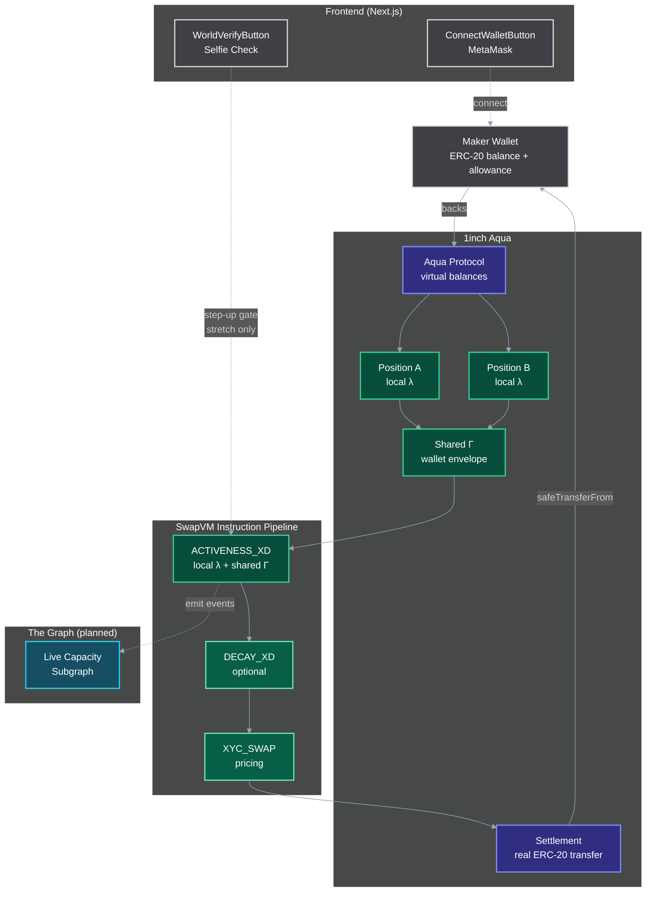
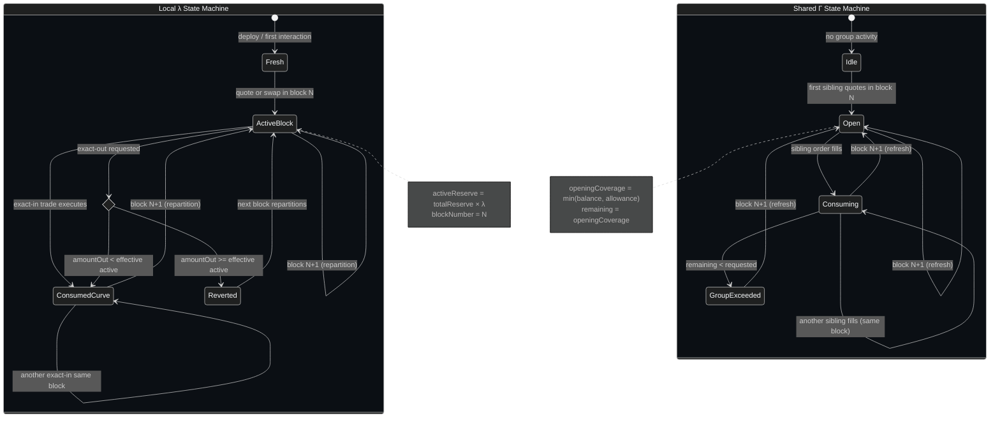
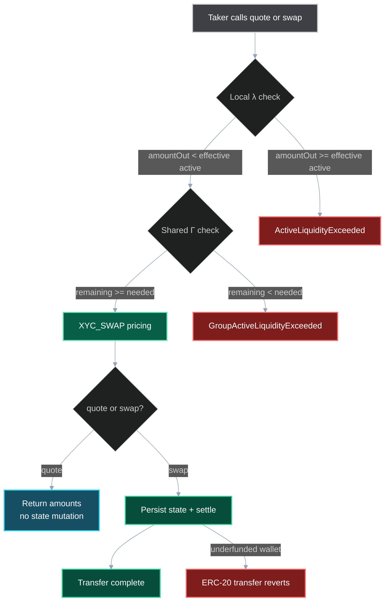
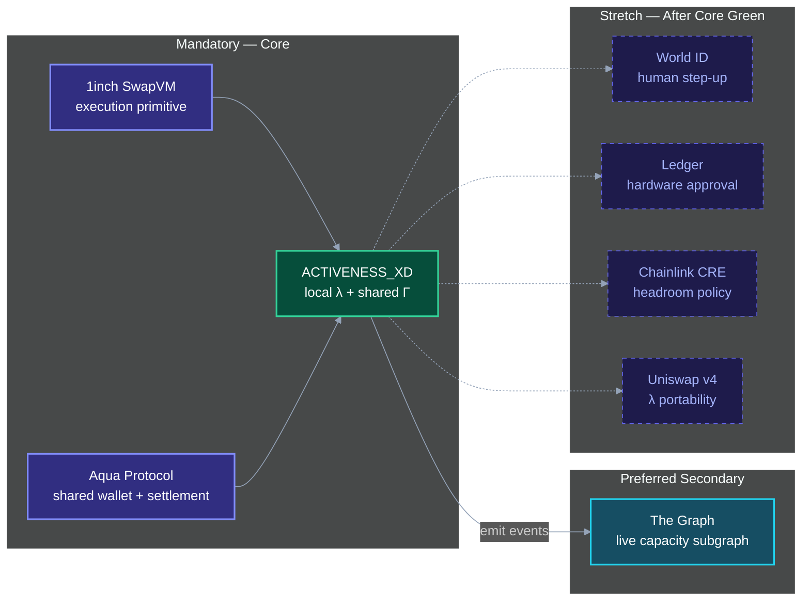
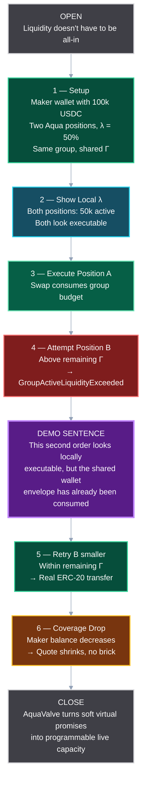

# AquaValve

> **Liquidity doesn't have to be all-in. AquaValve lets a maker decide how much goes live each block.**

AquaValve turns Aqua shared liquidity from soft virtual promises into programmable live capacity.

## The Problem

AMM liquidity is usually all-in: if an LP provides inventory, the market can reprice the full amount immediately. In 1inch Aqua, the situation is more subtle — one maker wallet can back many positions, and each strategy tracks virtual balances independently. A sibling position can look executable even after another sibling consumed the real wallet capacity, causing **route-first, revert-later** behavior.

AquaValve does not make an underfunded wallet solvent. Aqua's ERC-20 transfer remains the final hard constraint. AquaValve moves the failure earlier: from settlement-time revert to **quote-time deterministic capacity**.

## What AquaValve Does

AquaValve adds a SwapVM instruction called `ACTIVENESS_XD` with two layers:

### Local λ — per-position live liquidity

A maker sets a local activeness fraction. If the full virtual reserve is 100 ETH / 400,000 USDC and `λ = 20%`, this block's active curve starts as 20 ETH / 80,000 USDC.

- `λ = 100%` behaves like normal XYC (no restriction).
- Same-block trades continue on the consumed active curve — no fresh slice.
- Exact-out reverts only when `amountOut >= finalEffectiveActiveOut`.
- Next block repartitions from the current total state.

### Shared Γ — wallet-level execution envelope

Sibling Aqua positions sharing the same maker wallet get a per-maker, per-group, per-token envelope. Executable coverage is clamped to:

```
min(maker token balance, maker allowance to Aqua)
```

- Coverage drops **shrink** quotes instead of bricking `quote()` calls.
- Same-block inflows do not reopen the envelope until the next block.
- Group state is keyed by `maker + groupId + token` in ordinary storage (not transient).

## Architecture



## Execution Flow

```mermaid
%%{init: {"theme":"dark","themeVariables":{"background":"#0b0f14","primaryColor":"#1f2937","primaryTextColor":"#f8fafc","primaryBorderColor":"#64748b","lineColor":"#94a3b8","fontFamily":"Inter, ui-sans-serif, system-ui, sans-serif"}}}%%
sequenceDiagram
    autonumber
    participant T as Taker / Solver
    participant R as AquaValveRouter
    participant V as ACTIVENESS_XD
    participant X as XYC_SWAP
    participant M as Maker Wallet

    T->>R: quote/swap(order, amount)

    rect rgb(6,78,59)
        Note over V: Local λ Phase
        R->>V: computeEffectiveReserves
        V->>V: load localState[orderHash][token]
        alt same block
            V->>V: continue on consumed active curve
        else new block
            V->>V: repartition from total state
        end
    end

    rect rgb(22,78,99)
        Note over V: Shared Γ Phase
        V->>V: load groupState[maker][groupId][token]
        alt same block
            V->>V: clamp to stored remaining
        else new block
            V->>M: read balanceOf + allowance
            M-->>V: coverage = min(balance, allowance)
            V->>V: open fresh envelope
        end
        V-->>R: final effective reserves
    end

    R->>X: XYC constant-product pricing
    X-->>R: amountIn / amountOut

    alt swap path (not quote)
        R->>V: applyActiveness (persist state)
        R->>M: transferFrom(taker→maker, tokenIn)
        R->>M: transferFrom(maker→taker, tokenOut)
    end
```



## State Machine



## Failure Paths



## Sponsor Layers



## Decay vs AquaValve

Decay controls **how quickly** price impact recovers. AquaValve controls **how much inventory** participates in that repricing. They are orthogonal and composable:

| Pipeline | What it tests |
|---|---|
| XYC only | Baseline |
| DECAY + XYC | Time recovery without liveness control |
| ACTIVENESS + XYC | Liveness control without time recovery |
| ACTIVENESS + DECAY + XYC | Full composition |

## Demo Flow



## Key Files

### Contracts (implemented)

```
contracts/Activeness.sol                — ACTIVENESS_XD instruction (local λ + shared Γ)
contracts/AquaValveRouter.sol           — SwapVM router (ACTIVENESS_XD → XYC_SWAP)
contracts/DemoTaker.sol                 — multi-order test helper
contracts/interfaces/IAqua.sol          — Aqua interface
contracts/interfaces/IERC20.sol         — ERC-20 interface
contracts/lib/SwapVMTypes.sol           — shared types (Order, LocalState, GroupState)
```

### Tests (passing)

```
test/ActivenessSinglePosition.t.sol     — Gate 1: 7 local λ tests
test/ActivenessGroupEnvelope.t.sol      — Gate 2: 4 shared Γ tests
test/MockERC20.sol                      — test token
```

### Frontend (implemented)

```
component/connectWallet/                — MetaMask wallet connection
component/world_verif_button/           — World ID Selfie Check (stretch)
lib/world_verif_button/                 — server-side verification handlers
app/                                    — Next.js pages and API routes
```

### Diagrams (Mermaid source)

```
docs/diagrams/01_architecture.mmd
docs/diagrams/02_execution_sequence.mmd
docs/diagrams/03_state_machine.mmd
docs/diagrams/04_failure_paths.mmd
docs/diagrams/05_sponsor_layers.mmd
docs/diagrams/06_demo_flow.mmd
```

## Running

### Contracts

```bash
forge build
forge test -vvv
```

### Frontend

```bash
npm install
npm run dev
```

## Test Results

| Gate | Scope | Tests | Status |
|---|---|---|---|
| Gate 0 | `forge build` compiles | — | **Pass** |
| Gate 1 | Local λ | 7/7 | **Pass** |
| Gate 2 | Shared Γ | 4/4 | **Pass** |
| Gate 3 | Decay composition | — | Planned |
| Gate 4 | Demo | — | Planned |

## Sponsor Fit

| Sponsor | Layer | Removal Test |
|---|---|---|
| **1inch Aqua** | Shared wallet + settlement | Core — cannot remove |
| **SwapVM** | `ACTIVENESS_XD` instruction | Core — cannot remove |
| **The Graph** | Live capacity subgraph | Remove → core works, discovery is manual |
| World ID | Human step-up gate (stretch) | Remove → core works |
| Ledger | Hardware approval (stretch) | Remove → core works |
| Chainlink CRE | Private headroom policy (stretch) | Remove → core works |
| Uniswap v4 | Local λ portability proof (stretch) | Remove → core works |

## Non-Claims

- AquaValve does **not** guarantee solvency.
- World ID Selfie Check does not secure swaps.
- No test or deployment success is claimed without command output.
- Model tests are not Solidity integration tests.
