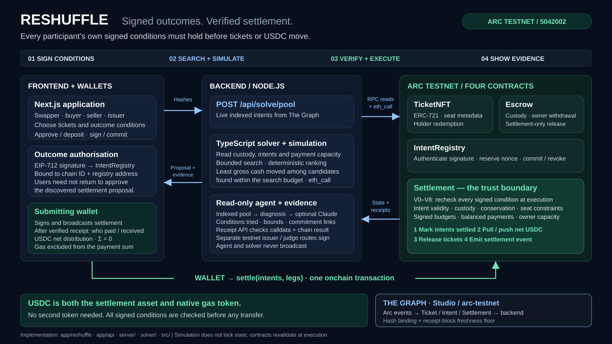
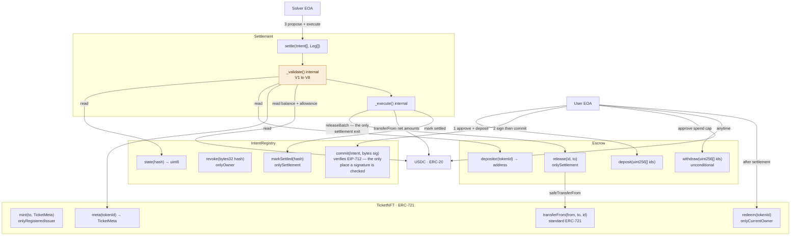
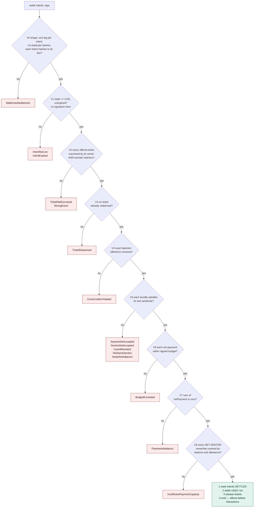
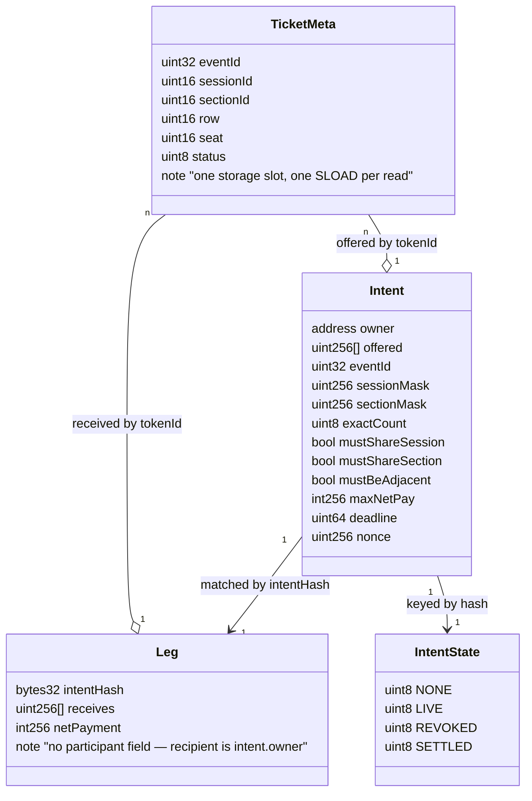
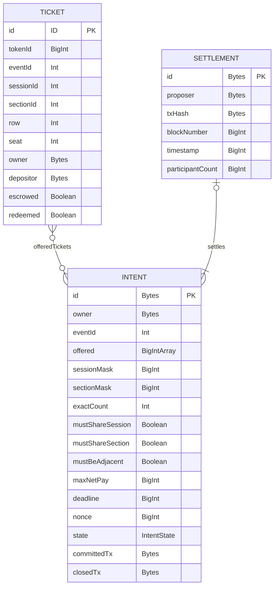
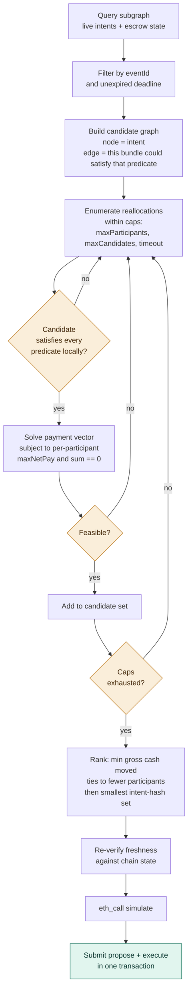
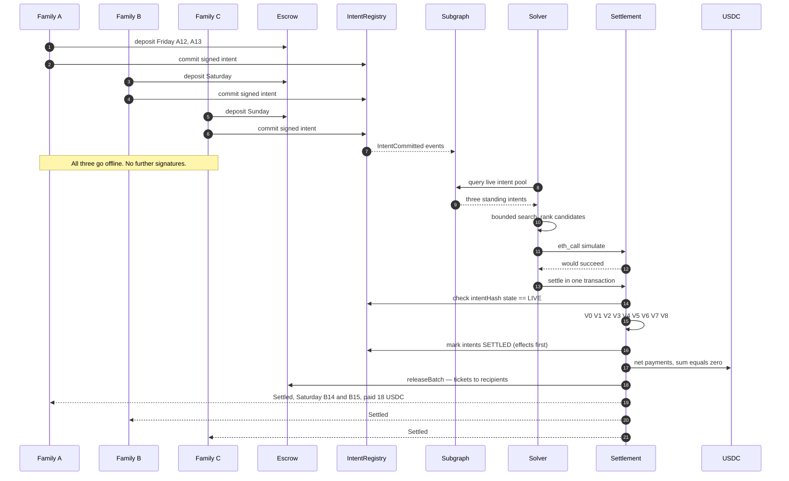
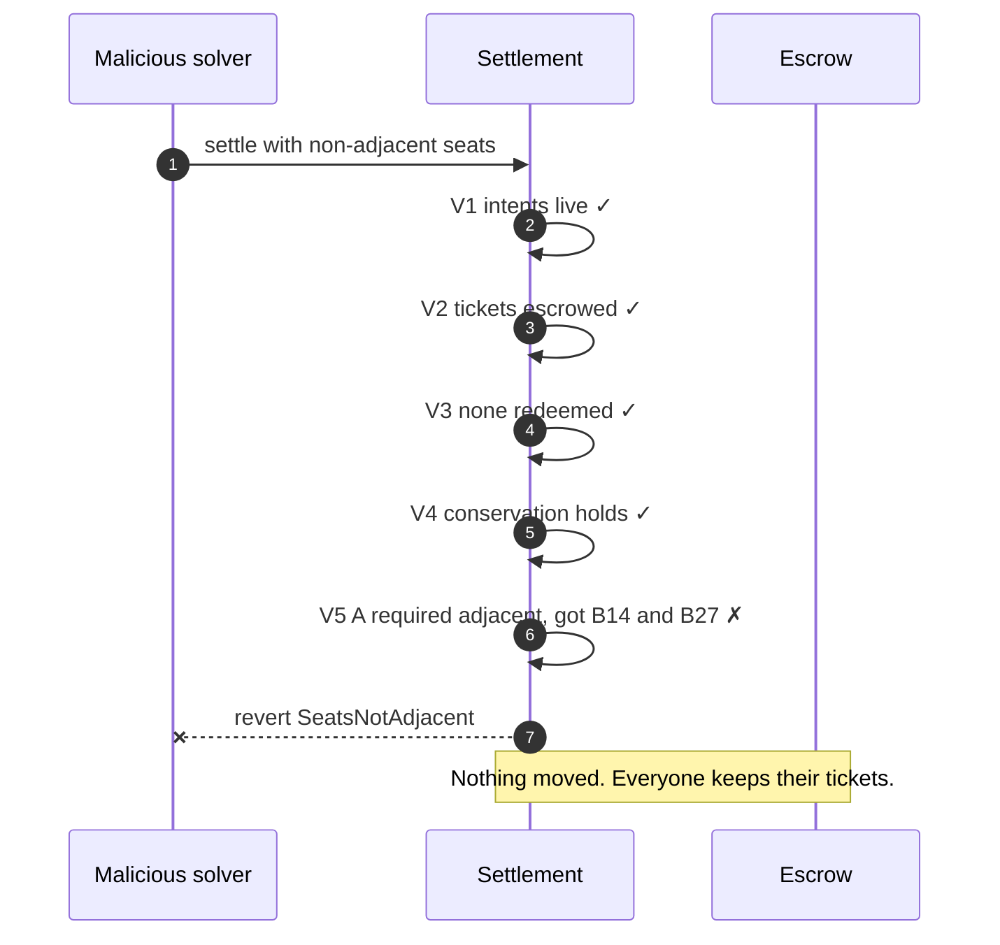
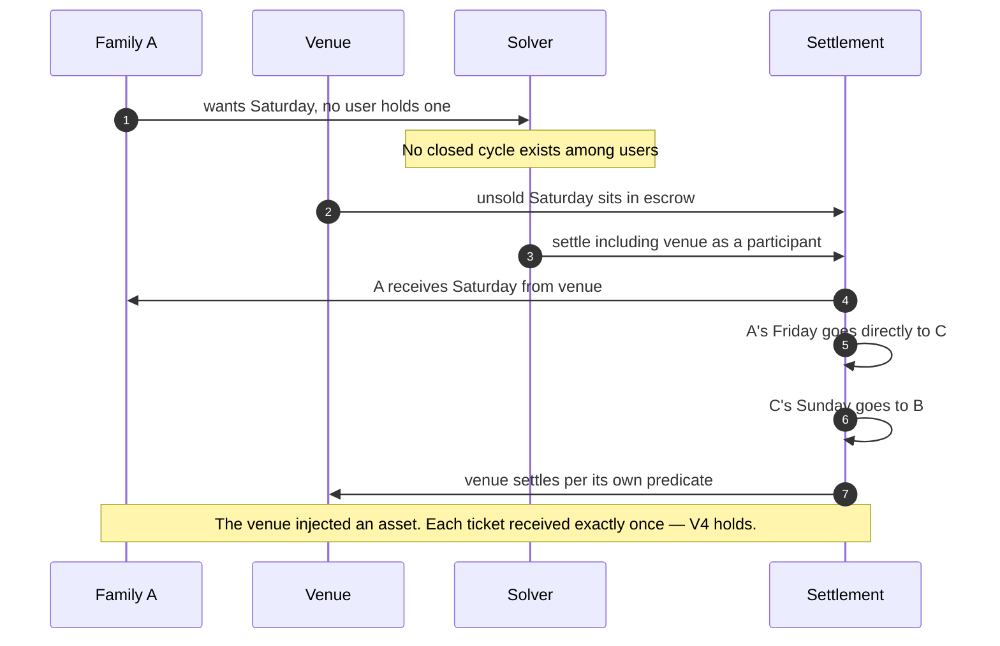

# Reshuffle

**Swap tickets without selling them first.**

Reshuffle matches people who want different tickets and settles NFT ticket transfers and USDC payments together on Arc Testnet. Users sign the ticket requirements and payment limits they will accept. An exchange proceeds only when every participant's signed conditions are satisfied.

[Public app](https://online2026.vercel.app/) · [Backend health](https://online2026.vercel.app/api/health) · [Demo guide](docs/JUDGING_SETUP.md)

## The problem

Changing tickets can mean selling the ones you have before securing replacements, or buying a second set first. A direct swap also fails when nobody wants exactly what you hold.

For example, A holds Friday tickets and wants Saturday, B holds Saturday and wants Sunday, and C holds Sunday and wants Friday. No pair can swap, but all three can exchange together.

Reshuffle supports these multi-party exchanges, including requirements such as an exact ticket count, adjacent seats and a maximum extra payment. Buyers, sellers and unsold issuer inventory can also participate, so a closed cycle is not required.

## How it works

1. **Set your requirements.** Choose the tickets to offer, acceptable sessions and sections, exact quantity, seating requirements, payment limit and expiry.
2. **Deposit and authorize.** Deposit offered NFT tickets into escrow, approve USDC spending when needed, then sign and commit an EIP-712 intent.
3. **Find a match.** The backend reads The Graph's indexed pool, runs the TypeScript solver, checks chain state and simulates a proposed settlement.
4. **Settle together.** A proposer wallet submits one transaction. The contracts validate every condition and transfer tickets and net USDC amounts together, or revert the entire exchange.

Participants do not need to return or sign the matched proposal. Their intents, escrowed tickets and payment capacity must still be valid at execution. Tickets can be withdrawn and intents revoked before settlement.

In the current UI, matching runs once after a new intent is committed and indexed, and on demand through **Matching → Check all intents**. Settlement is a separate wallet transaction; there is no continuous background matching or automatic execution.

## Architecture



| Component | Responsibility |
|---|---|
| **Next.js frontend** | Ticket workspace, requirement selection, wallet interaction, matches and receipts |
| **Next.js / Node.js backend** | Indexed market reads, solver requests, chain verification, simulation and receipt verification |
| **TypeScript solver** | Bounded ticket reallocation search, payment feasibility and candidate ranking |
| **The Graph** | Ticket inventory, committed intents and settlement history indexed from contract events |
| **Arc Testnet contracts** | NFT ticket custody, signed commitments, condition checks and USDC settlement |
| **Optional Claude assistant** | Evidence-based diagnosis and what-if explanations; no signing capability |
| **Redis** | Shared hosted evidence, claims, sessions, signing jobs, demo catalog and agent rate limits |

### Contract call graph



### Arc Testnet

Tickets are issuer-native ERC-721 NFTs. Four contracts handle the exchange:

| Contract | Role |
|---|---|
| `TicketNFT` | Ticket metadata, ownership and redemption |
| `Escrow` | Holds deposited tickets; permits depositor withdrawals and settlement-authorized releases |
| `IntentRegistry` | Verifies EIP-712 signatures at commit and tracks intent state |
| `Settlement` | Validates proposals and executes ticket delivery and USDC net payments |

`settle(Intent[], Leg[])` requires no new participant signatures. It recomputes intent hashes and checks live state, expiry, escrow custody, redemption status, ticket conservation, received-bundle requirements, payment limits and payment capacity.

USDC is used for both settlement and native transaction gas. Settlement payments sum to **exactly zero**, excluding gas. Positive `netPayment` means paying; negative means receiving. Each leg must satisfy `netPayment <= maxNetPay`, and balances and allowances are checked against each wallet's combined net debit.

All transfers are in one transaction. A failed condition or transfer reverts the exchange; the submitting wallet still pays gas. Simulation does not reserve tickets or funds.

[Circle integration and deployment evidence](docs/CIRCLE_INTEGRATION.md) · [Admin permissions and mainnet readiness](docs/MAINNET_READINESS.md) · [App Kit evaluation — not integrated](docs/APP_KITS_EVALUATION.md)

<details>
<summary>Settlement validation — V0–V8</summary>



</details>

<details>
<summary>Data model — TicketMeta, Intent and Leg</summary>



</details>

### The Graph

`IntentRegistry` records commitments but does not store an enumerable pool of full matching conditions. The Graph reconstructs that pool from events and exposes three entities: `Ticket`, `Intent` and `Settlement`.

The backend verifies indexed intent hashes, waits for the required receipt block after writes, and pins paginated reads to one snapshot. Chain state at execution remains authoritative. Per-leg ticket allocations and USDC payments are decoded from transaction input and verified through RPC, not indexed as a separate `SettlementLeg` entity.

[Live subgraph: reshuffle v0.1.1](https://api.studio.thegraph.com/query/1760168/reshuffle/v0.1.1) · [Schema](subgraph/schema.graphql) · [Graph verification](docs/graph-acceptance.md)

<details>
<summary>Subgraph schema — Ticket, Intent and Settlement</summary>



</details>

### Matching and assistant APIs

| Endpoint | Purpose |
|---|---|
| `POST /api/solve/pool` | Search the indexed pool within the configured limits |
| `POST /api/solve` | Evaluate two to four selected intent hashes |
| `GET /api/agent/diagnose/<intent-hash>` | Return deterministic diagnosis, evidence and search bounds |
| `POST /api/agent/ask` | Answer questions using optional Claude tool selection and evidence-bound responses |

**The matching solver is project code, not an external AI matching API.** Claude can select `diagnose_intent`, `what_if` and `pool_overview` tools; it does not authorize or execute swaps. Without an Anthropic key, the assistant returns deterministic diagnosis rather than interpreting arbitrary what-if questions.

Diagnosis and what-if checks use one indexed block, including USDC capacity reads. Hypothetical changes cannot be submitted as settlements; changing actual requirements requires a newly signed commitment. Separate testnet issuer and judge routes may sign for controlled demo wallets, but the agent cannot.

[Backend reference](server/README.md) · [Agent implementation and evidence](docs/GRAPH_7G_7H.md)

<details>
<summary>Solver internals</summary>



</details>

## Sequence diagrams

### Happy path — a three-way reshuffle with nobody online



### Rejection path — the contract refuses a malicious proposal



The guarantee does not rest on trusting our solver. A different solver could submit anything; the contract still refuses.

### Issuer inventory unlocking a broken chain



## Demo evidence

The repository records these Arc Testnet transactions. Demo scenes display the transactions and their supporting evidence.

| Scenario | App route | Transaction | Evidence |
|---|---|---|---|
| Three participants exchange six tickets | `/demo/act-one` | [Confirmed settlement](https://testnet.arcscan.app/tx/0xdc54e3971c04dc533b1ad3604cd29368cb67556d265fb093b60e146e5e6f3143) | [Record](deployments/act-one.json) |
| Buyer, two swappers and seller settle an open chain | `/demo/act-two` | [Confirmed settlement](https://testnet.arcscan.app/tx/0x6df107019a5bb2d47654a12cf594923adf5f3cfb6259ba3a49d870f79e9ce29e) | [Record](deployments/act-two.json) |
| Non-adjacent allocation is rejected with `SeatsNotAdjacent` | `/demo/act-three` | [Reverted transaction](https://testnet.arcscan.app/tx/0x087f78f9bdc54b5f9bb8f6939f2a4633ee1f554e8fc198cc75739b1b722279fe) | [Record](deployments/act-three.json) |
| Separate solver settles after participant signing processes exit | `/demo/offline` | [Confirmed settlement](https://testnet.arcscan.app/tx/0xffd5f35dcac46cd52c6593d6c2a34a74b07ed4859c848b39ba09421e109d07c9) | [Record](deployments/offline-demo.json) |

## Run locally

Use **Node.js 22 or newer**. Foundry is needed for Solidity development and tests.

```sh
npm ci
npm --prefix solver ci
npm run setup:env
```

### Environment setup

**Running your own instance? Configure your own environment variables and supply any credentials required for the features you enable. Private credentials are not included in this repository.** Visitors to the hosted app do not need to upload an environment file or provide Arc / The Graph API keys.

`npm run setup:env` creates `.env.local` from [.env.example](.env.example) without overwriting an existing file. Edit the generated file using this format:

```dotenv
# Arc Testnet — public settings, not private credentials
DEPLOYMENT=arc-testnet
NEXT_PUBLIC_DEPLOYMENT=arc-testnet
ARC_CHAIN_ID=5042002
# Keep this public RPC, or replace it with your own Arc Testnet provider URL.
ARC_RPC=https://rpc.testnet.arc.io

# The Graph — use the existing subgraph, or your own compatible deployment.
READ_SOURCE=graph
SUBGRAPH_URL=https://api.studio.thegraph.com/query/1760168/reshuffle/v0.1.1
# Add YOUR query API key only if your chosen endpoint requires authentication.
SUBGRAPH_API_KEY=

# Optional: add YOUR Anthropic API key for model-assisted questions.
ANTHROPIC_API_KEY=
```

The public settings above support market reads, matching and deterministic diagnosis without a wallet private key or Graph query key. Use `SUBGRAPH_API_KEY`, not `GRAPH_API_KEY`; never prefix a secret with `NEXT_PUBLIC_`.

<details>
<summary>Optional credentials for deploying contracts or a subgraph</summary>

Only configure these when using the corresponding deployment tools. Uncomment and replace the placeholders with your own values; they are not needed to run the app against the existing deployment.

```dotenv
# Arc transaction CLI — use a dedicated testnet wallet, never a real-funds wallet.
# PRIVATE_KEY=0xYOUR_TESTNET_WALLET_PRIVATE_KEY
# DEPLOYER_ADDRESS=0xYOUR_MATCHING_WALLET_ADDRESS

# The Graph deployment CLI — your Subgraph Studio deploy key, not a query key.
# SUBGRAPH_DEPLOY_KEY=YOUR_SUBGRAPH_STUDIO_DEPLOY_KEY
```

Next.js loads `.env.local`, but CLI scripts may explicitly load `.env`; seed-wallet keys are read from `.env.seed`. Put credentials in the environment loaded by the relevant command. Contract addresses come from `deployments/<network>.json`, not these credentials. See [deployment configuration](docs/MAINNET_READINESS.md) and [demo setup](docs/DEMO_SETUP.md) before deploying or seeding.

</details>

**Keep secrets private:** keep `.env`, `.env.local` and `.env.seed` out of Git. Only commit templates with public settings and empty credential fields. For hosting, configure credentials in the server's environment settings rather than uploading private files to the repository. Never ask app users to submit wallet private keys.

### Start the app

```sh
npm run dev
```

Open `http://localhost:3000/` and select an event poster. Use **Matching → Check all intents** to search, or **Why no match?** to inspect an intent.

Creating an intent or submitting a settlement requires connecting a wallet on **Arc Testnet, chain ID `5042002`**, with test USDC from the [Circle faucet](https://faucet.circle.com/). Users sign through their wallet; no wallet private key needs to be entered in the app's environment file.

### Prepare the interactive demo

With the existing Arc deployment and local operator credentials configured:

```sh
npm run demo:prepare
npm run dev
```

Open `/demo`. Preparation creates or reuses a pending round with three signed intents and twelve escrowed tickets, then checks it with the solver and `eth_call`. It does **not** submit settlement. Rerun after a round is consumed to prepare fresh intents.

[Interactive demo setup](docs/DEMO_SETUP.md) · [Additional inventory](docs/DEMO_INVENTORY.md) · [Three-user circle groups](docs/CIRCLE_DEMO.md)

### Hosting

Deploy both the Next.js frontend **and backend**. On-chain contracts do not replace the solver, agent or evidence services.

```sh
npm run build
npm start
```

Hosted instances use `STORAGE_BACKEND=redis` with `REDIS_REST_URL` and `REDIS_REST_TOKEN`, or a supported provider-injected credential pair. Production agent APIs require Redis; local-file storage is rejected on Vercel.

For prepared judge controls, configure a private access code and an explicit allowlist of editable intent hashes. Public reads do not require this code. See the [hosting, migration and judging guide](docs/JUDGING_SETUP.md) before sharing a deployment.

## Contracts

**Network:** Arc Testnet · **Chain ID:** `5042002`

| Contract | Address |
|---|---|
| TicketNFT | [`0xb2490568bb27c9c38588e3b5511ee3980892cce4`](https://testnet.arcscan.app/address/0xb2490568bb27c9c38588e3b5511ee3980892cce4) |
| Escrow | [`0x07ab57380db7df630fab2d3d3a1019a5a890b018`](https://testnet.arcscan.app/address/0x07ab57380db7df630fab2d3d3a1019a5a890b018) |
| IntentRegistry | [`0x479b4455f494679dcdd6f6f32e93e08682deda75`](https://testnet.arcscan.app/address/0x479b4455f494679dcdd6f6f32e93e08682deda75) |
| Settlement | [`0x75872168f2d6ae13c7d9258159e59025fd9b5eae`](https://testnet.arcscan.app/address/0x75872168f2d6ae13c7d9258159e59025fd9b5eae) |

## Tests

```sh
forge build
forge test -vvvv
npm test
npm --prefix solver test
npm run deployment:check
npm run subgraph:check
npm run subgraph:parity
npm run docs:check
npx tsc --noEmit
```

Parity checks use the configured Graph and RPC endpoints. To build the subgraph locally:

```sh
npm --prefix subgraph ci
npm run subgraph:codegen
npm --prefix subgraph run build
```

[Verification records](docs/STEP_11_REVIEW.md) · [Local settlement gas measurements](docs/gas/README.md)

## Repository

```text
src/                   Solidity contracts
script/                Foundry deployment and seeding
scripts/               Deployment, evidence and verification tools
test/                  Solidity tests
solver/src/            TypeScript matching and validation
shared/                Intent hashing and Graph snapshot client
subgraph/              Schema and event mappings
server/                Market, solver, receipts and agent services
app/api/               Next.js API routes
component/market/      Ticket workspace and agent drawer
lib/                   Frontend models, configuration and API clients
deployments/           Chain records and transaction evidence
docs/                  Technical references, demo guides and submission details
```

### AI disclosure

AI coding assistance was used during development. The [planning artifacts](docs/PLANNING_ARTIFACTS.md) and [provenance inventory](docs/PROVENANCE.md) record confirmed assistance, dependencies, supplied artwork and outstanding attribution confirmations. Optional Claude use inside the application is separate from development assistance.
