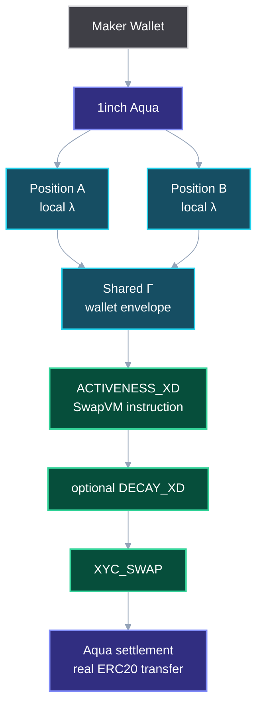

# AquaValve

> **Liquidity doesn't have to be all-in. AquaValve lets a maker decide how much goes live each block.**

AMMs made price programmable. AquaValve makes liquidity liveness programmable.

AquaValve is a custom 1inch Aqua app and SwapVM extension that introduces `ACTIVENESS_XD`: a stateful instruction that controls how much liquidity is active in a block. It gives each position a local valve `λ`, and sibling positions sharing the same Aqua maker wallet a shared execution envelope `Γ`.

## Problem

Today, AMM liquidity is usually all-in: if an LP provides inventory, the market can reprice that full inventory immediately. In Aqua, the situation is more subtle: one maker wallet can back many positions, and each strategy tracks virtual balances independently. A sibling position can look executable even after another sibling consumed the real wallet capacity, causing route-first, revert-later behavior.

AquaValve does not make an underfunded wallet solvent. Aqua's ERC-20 transfer remains the final hard constraint. AquaValve moves the failure earlier: from settlement-time revert to quote-time deterministic capacity.

## What AquaValve Adds

### Local λ — per-position live liquidity

A maker can set a local activeness parameter:

```text
λ = 20%
```

If the full virtual reserve is:

```text
100 ETH / 400,000 USDC
```

then this block's active curve starts as:

```text
20 ETH / 80,000 USDC
```

Same-block trades do not receive a fresh 20%. A second exact-in trade can still execute, but it faces the active curve after the first trade consumed it. Exact-out reverts only when the requested output is greater than or equal to the remaining final effective active output reserve.

### Shared Γ — wallet-level execution envelope

Sibling Aqua positions can share the same maker wallet. AquaValve tracks a per-maker, per-group, per-token envelope so sibling positions do not independently quote more deterministic live capacity than the wallet can release this block.

Executable coverage is clamped to:

```text
min(maker token balance, maker allowance to Aqua)
```

Coverage drops shrink quotes instead of bricking quote calls.

## Architecture



## Decay vs AquaValve

Decay controls how quickly price impact recovers. AquaValve controls how much inventory participates in that repricing. They are orthogonal and composable:

```text
ACTIVENESS_XD → DECAY_XD → XYC_SWAP
```

## Key Files

```text
contracts/Activeness.sol
contracts/AquaValveRouter.sol
contracts/AquaValveOrderBuilder.sol
contracts/DemoTaker.sol
test/ActivenessSinglePosition.t.sol
test/ActivenessGroupEnvelope.t.sol
test/ActivenessDecayComposition.t.sol
docs/diagrams/*.mmd
```

## Running

```bash
forge build
forge test
```

## Demo Path

1. Create two Aqua positions backed by one maker wallet.
2. Show both have local active reserves.
3. Execute Position A.
4. Show Position B still looks locally executable.
5. Attempt Position B above remaining shared Γ and show `GroupActiveLiquidityExceeded`.
6. Retry with smaller exact-out and show real ERC-20 transfer.
7. Show coverage drop shrinks quote instead of bricking it.
8. Show `ACTIVENESS_XD + DECAY_XD + XYC_SWAP` composition.

## Sponsor Fit

- **1inch Aqua:** shared maker wallet and strategy settlement.
- **SwapVM:** `ACTIVENESS_XD` executes liveness inside the swap path.
- **The Graph:** optional live-capacity discovery layer for solvers and UI.

## Non-Claims

AquaValve does not guarantee solvency, replace wallet signatures, replace Decay, or require World/Uniswap to be complete. Stretch integrations must not weaken the main Aqua/SwapVM story.
