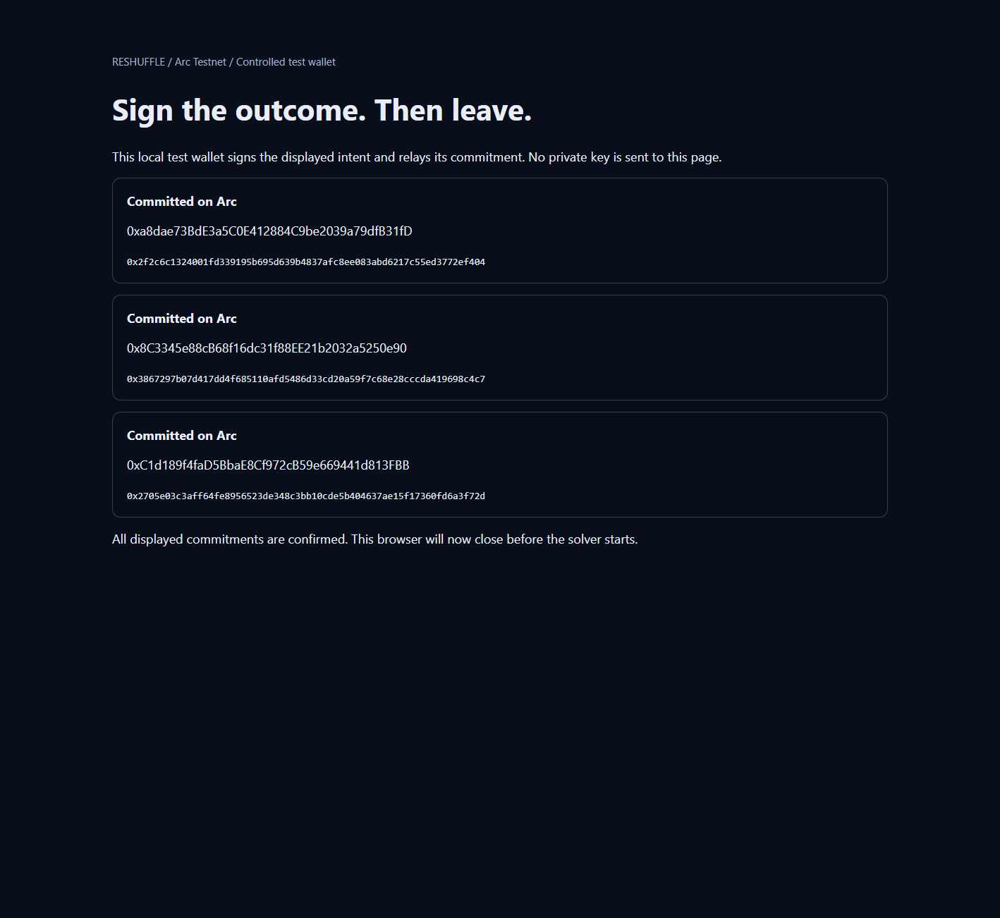

# Sign once, close the page, settle later

Open **`/demo/offline`** from the pending demo. This recorded scene re-verifies the actual Arc transaction, original commit signatures and historical participant transaction counts. No wallet connection is needed to inspect it.

[Settlement transaction](https://testnet.arcscan.app/tx/0xffd5f35dcac46cd52c6593d6c2a34a74b07ed4859c848b39ba09421e109d07c9), block **61378348**. [Public evidence JSON](../deployments/offline-demo.json).

## What happened

The local runner minted a separate six-ticket pool, #28–33. Three participant wallets deposited their pairs and authorized a replacement pair with session/section masks, exact count, adjacency and USDC budget constraints. The signed intents were committed through the same deployed IntentRegistry; no contract changes were required.

The participant page is an explicitly labeled **controlled test wallet**, served on an ephemeral loopback port. Headless Chrome clicks its authorization buttons. Each button asks the local participant process to sign only the displayed, predetermined EIP-712 intent and relay `commit()`. No private key enters the browser. This is a reproducible wallet harness, not a MetaMask interaction or a human signing recording.

| Stage | Observed value | Evidence source |
|---|---|---|
| A, B, C committed | blocks 61378281, 61378300, 61378317 | Successful on-chain commit receipts; signatures recover to their respective owners |
| Before closing | block 61378323; all three intents LIVE | Historical registry state and account nonces |
| Browser exited | 2026-09-10 09:43:43.794 UTC | Local Chrome process exit after CDP `Browser.close` |
| Signing server stopped | 2026-09-10 09:43:43.795 UTC | Local HTTP server close callback |
| Participant process exited | 2026-09-10 09:43:46.796 UTC | Parent observed exit code 0 |
| Independent solver started | 2026-09-10 09:43:48.849 UTC | Separate child process start record |
| Settlement succeeded | block 61378348 | Arc receipt, calldata, events and historical state |

The solver proposer was `0x0dcd390c1df4cd14DE2EB9bbB53271ae9f48e034`, distinct from A, B and C. Its child environment contains only its own signing credential, `SOLVER_PRIVATE_KEY`, plus RPC/backend and essential OS configuration. The worker does not load dotenv or the participant journal. Process separation here is an application workflow property, not an operating-system sandbox against malicious code reading the local filesystem.

The worker requests `/api/solve` using only the three committed hashes. The backend reads chain state, searches and simulates. The worker binds the returned calldata to those hashes and deployed Settlement, checks participant nonces, simulates again as the actual proposer, then broadcasts with an explicit 8,000,000 gas limit. Simulation does not lock state; the contract revalidates every condition at execution.

| Participant | Wallet | Transaction nonce before close → after settlement | Replacement | USDC net received |
|---|---|---|---|---|
| A | `0xa8dae73BdE3a5C0E412884C9be2039a79dfB31fD` | 127 → 127 | #28,29 → #30,31 | −0.10 |
| B | `0x8C3345e88cB68f16dc31f88EE21b2032a5250e90` | 27 → 27 | #30,31 → #32,33 | 0.00 |
| C | `0xC1d189f4faD5BbaE8Cf972cB59e669441d813FBB` | 26 → 26 | #32,33 → #28,29 | +0.10 |

The USDC sum is exactly zero, derived from the settlement legs and checked against ERC-20 transfers. The proposer pays the separate Arc transaction fee in native USDC.

## What the proof establishes

- Original EIP-712 signatures recover to the owners, and those committed hashes are exactly the ones settled later.
- `settle()` calldata carries **intents and legs**, with no new participant signatures. Only the independent proposer's transaction signature is needed for submission.
- The participant EOAs sent no additional transactions between the pre-close boundary and the settlement block. The accounts' transaction nonces are distinct from the IntentRegistry's signed intent nonces.
- Six NFT transfers, all three LIVE → SETTLED transitions, cleared escrow custody, and the USDC debits/credits are verified against historical chain state and the successful receipt.
- The local runner observed browser, signing server and participant process termination before starting the solver worker.

Browser closure is **not an on-chain fact**. Local timestamps do not prove a participant's other devices were offline. Unchanged account nonces alone do not prove no off-chain signature was produced; the signature-free settlement interface and the worker's lack of participant signing calls establish that none was needed in this workflow.

Pre-authorization does not promise eventual execution. Intents must remain LIVE and unexpired; tickets must remain escrowed and valid; USDC balance and spending allowance must remain sufficient. A participant can revoke an intent or withdraw tickets, and the contract will refuse a stale proposal.

## Run and verify

With the existing local Arc credentials and backend available:

```bash
npm run dev
# In another terminal:
npm run demo:offline
```

For a fresh, unrecorded scene this command runs authorization, closes the isolated browser, waits for the participant process to exit, then starts the independent solver and records the result. `CHROME_PATH` may point to a Chrome/Chromium executable; the default is the Windows Chrome installation. `SOLVE_API_URL` defaults to `http://127.0.0.1:3000`. Use the existing funded A/B/C test wallets and distinct D solver wallet in the ignored local env files. The command never closes the user's normal browser.

**This repository already contains a completed proof.** Running the command now only re-verifies that transaction and sends nothing. An explicit read-only check is:

```bash
npm run demo:offline -- --verify
node --test scripts/test-offline.mjs
forge test --match-test test_settles_without_participant_online -vv
```

Interrupted runs retain signed transaction bytes in ignored `.data/offline-*-journal.json` files and resend the same transaction hash. Keep these files private and intact. A failed receipt never becomes a successful proof. Do not delete the public artifact or journals to try to force a new run; a new recorded round should use a separate manifest and journal namespace.

The Next.js API `/api/demo/offline` performs only reads and returns 503 if verification fails. Its page clears previous verification claims during retries and RPC failures. Host the public `deployments/offline-demo.json` with the app; the private journals and signing credentials are not needed to view the completed proof. The existing twelve-ticket pending scene and act-three control intents use separate ticket IDs.

## Presentation

Show the original authorization screenshot, then the page's local exit timeline, then the on-chain receipt and unchanged nonce table. Say: “These participants signed the outcomes and left. A different wallet submitted the settlement later. The contract still checked their adjacent seats and budgets.”



The screenshot is captured from the real local authorization page before `Browser.close`; the final result is read from Arc, not preloaded into the participant UI.
